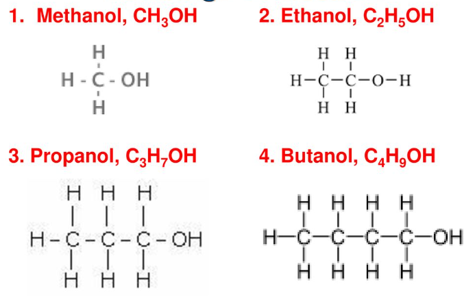

# 🏭 Alcohols and Carboxylic acids

## Functional groups

* A functional group is an atom or a group of atoms responsible for all of the chemical properties of a compound
* All alcohols react in similar ways as they contain the same functional group, the hydroxyl group ($$-OH$$​)
* All alkenes react in similar ways as they all have the $$C=C$$​ functional group
* Alkanes do not have a functional group

## Alcohols

* The alcohol homologous series is a family of organic compounds
* General formula of $$C_nH_{2n+1}OH$$
* Functional group of $$-OH$$

| Number of carbon atoms | Name     | Chemical fomula |
| ---------------------- | -------- | --------------- |
| 1                      | Methanol | $$CH_3OH$$​     |
| 2                      | Ethanol  | $$C_2H_5OH$$​   |
| 3                      | Propanol | $$C_3H_7OH$$​   |
| 4                      | Butanol  | $$C_4H_9OH$$    |

<figure><figcaption></figcaption></figure>

### Similarities in chemical properties

* Have the same general formula of $$C_nH_{2n+1}OH$$​
* Each member differs from the next by a $$-CH_2$$​ group
* Are covalent molecules
* Are colourless liquids at room temperature and pressure
* Have low boiling points, hence volatile liquids
* Are soluble in water

### Differences in physical properties

* The boiling and melting point increases
  * As the size of the molecules increases, the intermolecular forces of attraction between the molecules increases, and more energy is required to overcome these forces
* Density increases
* Viscosity increases
  * As the size of the molecule increases, the intermolecular forces of attraction between the molecules increases, causing the molecule to be tangled more easily
* Flammability decreases
  * As the percentage of carbon by mass in a molecule increases, more oxygen is required to burn it
* Solubility in water decreases as the molecular size increases

### Ethanol

* Most important member of the alcohol homologous series as it is used as an alternative fuel, and it is known as a biofuel that can be obtained from plants, making it renewable
* Can be produced in two ways, addition of steam to ethene ([#substitution](alkanes-and-alkenes.md#substitution "mention"))(for all alcohols) and fermentation (ethanol only)

#### Fermentation

* Fermentation is a chemical process where the catalyst yeast acts on glucose to produce ethanol and carbon dioxide
* Glucose solution -> Ethanol + Carbon dioxide ($$C_6H_{12}O_6 (aq) \rightarrow 2C_2H_5OH (aq) + 2CO_2 (g)$$)
* Conditions
  * Yeast as a catalyst
  * 37°C
  * Absence of oxygen
* The carbon dioxide produced will cause frothing (formation of foam) to be observed in the test tube containing the limewater, and a white precipitate is seen in the limewater
* The dilute solution of ethanol produced will be up to about 15% in concentration, and when the alcohol exceeds this concentration, the yeast will denature and fermentation stops
* Yeast is filtered from the liquid mixture, while ethanol is obtained from the mixture by fractional distillation

<figure><figcaption></figcaption></figure>

* The experiment must be conducted at 37°C
  * Any higher, the enzymes will denature and will be unable to catalyse the reaction, and fermentation will stop
  * Any lower, the yeast may be inactive or the rate of reaction is too slow
* There must not be any oxygen
  * In the presence of oxygen, bacteria from the air oxidises the ethanol into ethanoic acid, turning the alcoholic drink sour if exposed to air for a few days
  * $$C_2H_5OH + O_2 \rightarrow CH_3COOH + H_2O$$​
  * The apparatus must be air-tight, and the rubber bung is secured tightly to the flask, while the limewater in the test tube prevents air from entering the apparatus

### Isomerism

* The position of the hydroxyl group ($$-OH$$​) in the carbon chain can vary
* The carbon chain can be straight or branched

<figure><figcaption></figcaption></figure>

### Reactions

#### Oxidation

* Alcohol undergoes oxidation when it is heated with an axified oxidizing agent, which acts as the catalyst (Acidified potassium manganate (VII), $$KMnO_4$$​)
* $$C_2H_5OH + 2[O] \rightarrow _{heat} CH_3COOH (aq) + H_2O(l)$$
* ​The colour of potassium manganate (VII) changes from purple to colourless&#x20;

#### Combustion

* Just like in alkanes, see [here](https://app.gitbook.com/s/f1DYy91teh26hkPJgHhz/\~/changes/QQykVAHSd0cwGGWISVu5/chemistry/alkanes-and-alkenes#combustion)

#### Esterification

* Will be covered later

### Uses of ethanol

* Alcoholic drinks
* Fuel in motorcars/ race cars/ rockets by itself or mixed with petrol
* Solvent to dissolve paints, varnishes, perfumes, deodorants, as it can dissolve substances insoluble in water and it evaporates quickly (volatile)
* Undergoes oxidation to make ethanoic acid for preserving food and making esters

## Carboxylic acids

* Carboxylic acids homologous series is a family of organic compounds
* General formula: $$C_nH_{2n+1}COOH$$​
* Functional group of $$-COOH$$​
* SImilar chemical properties

| Number of carbon atoms | Name           | Molecular formula |
| ---------------------- | -------------- | ----------------- |
| 1                      | Methanoic acid | $$HCOOH$$​        |
| 2                      | Ethanoic acid  | $$CH_3COOH$$​     |
| 3                      | Propanoic acid | $$C_2H_5COOH$$​   |
| 4                      | Butanoic acid  | $$C_3H_7COOH$$​   |

<figure><figcaption></figcaption></figure>

### Similarities in chemical properties

* Have the general formula $$C_nH_{2n+1}COOH$$​
* Have the functional group $$-COOH$$​
* Have chemical reactions similar to strong acids (react with moderately reactive metals, carbonates, bases and alcohols
* Have physical properties similar to strong acids
* Are colourless liquids
* Are soluble in water because of the $$-COOH$$​group
* Are weak acids as they ionise partially in water to form a low concentration of $$H^+$$​ ions
* pH is low (3-6)
* Have acidic properties due to the $$H^+$$​ ions produced

### Differences in physical properties

* The boiling and melting point increases
  * As the size of the molecules increases, the intermolecular forces of attraction between the molecules increases, and more energy is required to overcome these forces
* Density increases
* Solubility in water decreases as the molecular size increases

### Preparing acids

* [#oxidation](alcohols-and-carboxylic-acids.md#oxidation "mention") of alcohol by acidified potassium manganate(VII) solution
* Ethanoic acid is made industrially by the oxidation of ethanol in air with the help of enzymes in bacteria [#fermentation](alcohols-and-carboxylic-acids.md#fermentation "mention")

### Uses

* Ethanoic acid is used in food as flavouring and a preservative

### Reactions

#### Reactions with metals, bases and carbonate

* Ethanoic acids reacts with reactive metals such as sodium, potassium and magnesium to give a salt and hydrogen
  * Ethanoic acid + Magnesium -> Magnesium ethanoate + hydrogen
  * $$2CH_3COOH (aq) + Mg (s) \rightarrow (CH_3COO)_2Mg(Aq) + H_2 (g)$$
* Ethanoic acid reacts with carbonates to give a salt, water and carbon dioxide
  * Ethanoic acid + Magnesium carbonate -> Magnesium ethanoate + Water + carbon dioxide
  * ​$$2CH_3COOH(aq) + MgCO_3(s) \rightarrow (CH_3COO)_2Mg(aq) + H_2O(k) + CO_2(g)$$​
* Ethanoic acid reacts with bases to give a salt and water
  * Ethanoic acid + Copper (II) oxide -> copper (II) ethanoate + water
  * $$2CH_3COOH(aq) + CuO(s) \rightarrow (CH_3COO)_2Cu(Aq) + H_2O(l)$$


Replace the H from the acid


#### Esterification

* Esters are sweet-smelling, colourless liquids that are insoluble in water
* Contain the ​$$-COO-$$​functional group
* Formed by reacting a carboxylic acid with an alcohol, in a process known as esterification
* Condition: Concentrated sulfuric acid as a catalyst
* Example: Ethanoic acid and ethanol react in the presence of concentrated sulfuric acid to form water and an ester called ethyl ethanoate
  * $$CH_3COOH(aq) C_2H_5OH (aq)  \rightleftharpoons _{conc. \char32 H_2SO_4} CH_3COOC_2H_5 (aq) +H_2O(l)$$


Remove the H from the alcohol, and the OH from the acid, and join them together


* The first part of the ester's name is derived from the alcohol, while the second part is derived from the carboxylic acid
* Example: Methyl Ethanoate
  * Methyl -> Methanol (alcohol)
  * Ethanoate -> Ethanoic acid (carboxylic acid)
* Esters are used&#x20;
  * in the preparation of perfume due to their sweet fruity smell
  * As artificial food flavourings due to their sweet fruity smell
  * As solvents for cosmetics and glues
  * In soap as naturally occuring esters such as animals fats and vegetable oils are boiled with sodium hydroxide to form soap
