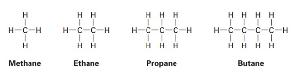
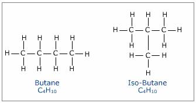
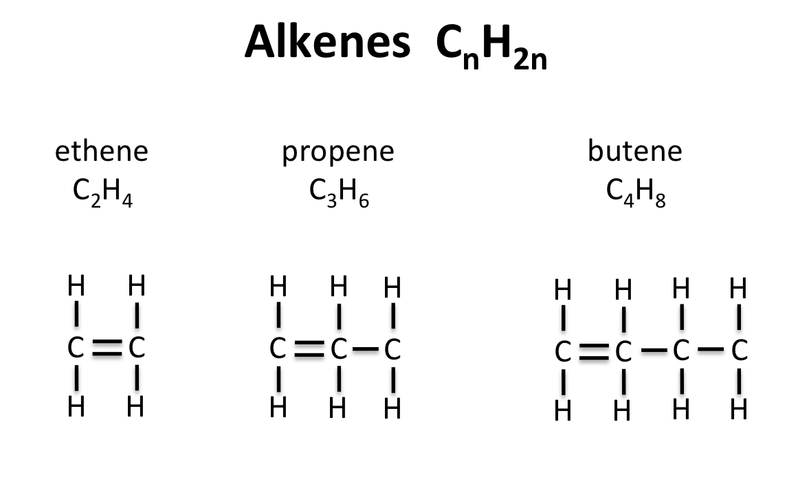
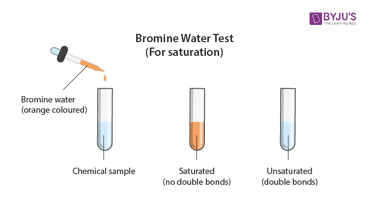
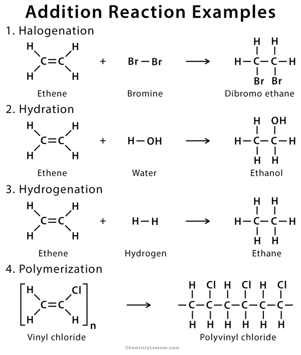
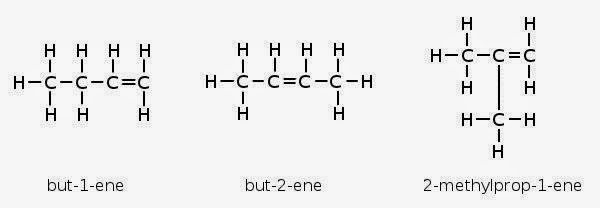

# 🏭 Alkanes and Alkenes

## Organic compounds

* Organic compounds are compounds containing the element carbon

### Classification

* Hydrocarbons and non-hydrocarbons (Hydrocarbons have hydrogen and carbon only!)
* Homologous series
* Number of carbon atoms

### Homologous series

* A homologous series is a family of organic compounds with a general formula and similar chemical properties, and showing a gradation in physical properties as a result of increase in the size and mass of molecules

## Alkanes

* The alkane homologous series is a family of organic compounds with a general formula and similar chemical properties
* General formula: $$C_nH_{2n +2}$$​

| Name    | Number of carbon atoms | Chemical formula |
| ------- | ---------------------- | ---------------- |
| Methane | 1                      | $$CH_4$$​        |
| Ethane  | 2                      | $$C_2H_6$$​      |
| Propane | 3                      | $$C_3H_8$$​      |
| Butane  | 4                      | $$C_4H_{10}$$​   |

<figure><figcaption></figcaption></figure>


**M**alvis **E**ats **P**eanut **B**utter


* Each compound has a difference of $$CH_4$$​ from its previous one

### Differences in physical properties

* The boiling and melting point increases
  * As the size of the molecules increases, the intermolecular forces of attraction between the molecules increases, and more energy is required to overcome these forces
* Density increases
* Viscosity increases
  * As the size of the molecule increases, the intermolecular forces of attraction between the molecules increases, causing the molecule to be tangled more easily
* Flammability decreases
  * As the percentage of carbon by mass in a molecule increases, more oxygen is required to burn it

### Similarities in chemical properties

* Have the same general formula of $$C_nH_{2n+2}$$
* Have similar chemical properties
* Show a gradation in physical properties as a result of increase in the size and mass of the molecules
* Are covalent compounds
* Are insoluble in water but soluble in organic solvent
* Are saturated hydrocarbons​
  * Saturated means they are compounds that have single covalent bonds between carbon atoms (C-C)
  * Hydrocarbon means they are compounds that contain only carbon and hydrogen

### Uses of alkanes

* Used as a fuel (can undergo combustion)
* Used as a source of other compounds (e.g. make solvents like tetrachloromethane) (substitution reaction)&#x20;
* Coating on raincoats to make them waterproof (Physical property of insolubility in water)

### Isomerism

<figure><figcaption></figcaption></figure>

* Isomers are compounds with the same molecular formula, but different structural formula
* Isomers have the same chemical formula and same chemical properties as their straight chain isomers, but different structural formula and physical properties such as boiling point
* Petrol is a mixture of hydrocarbons (Mainly branched chain hydrocarbons like iso-octane ($$C_8H_{18}$$​)).
  * Straight chain alkanes ignite very easily and burn readily, and if used as fuels in car engines, they ignite too early and explode instead of burning gently like branched-chain alkanes
  * Hence, isomerism is important in petrol fuel for motor cars as branched-chain isomers are preferred over straight-chain alkane molecules
* Methane, ethane and propane have no isomers
* Butane has 2 isomers, while pentane has 3

### Reactions

#### Substitution

* Alkanes undergo substitution reactions with halogens such as chlorine in the presence of sunlight or UV light as a catalyst
* Methane + Chlorine -> (UV or sunlight) Chloromethane + Hydrogen chloride gas
  * $$CH_4(g) + Cl_2 (g) \rightarrow CH_3Cl(g) + HCl(g)$$​
* Ethane + Bromine -> (UV or sunlight) Bromoethane + Hydrogen bromide gas
  * $$C_2H_6(g) + Br_2 (g) \rightarrow C_2H_5Br(g) + HBr(g)$$​


Naming structure: -/di/tri/tetra + chloro/ bromo + alkane


* It is a photochemical reaction because sunlight acts as a catalyst, providing the energy for the chlorine molecule to form chlorine atoms that attack the methane molecule
* Hydrogen atoms are replaced one by one
* Called a substitution reaction because a hydrogen atom in alkane molecule is substituted by a halogen atom
* Chloroalkanes are important solvents for other organic compounds

#### Combustion

* Combustion or burning of alkanes in excess oxygen (air) produced carbon dioxide ($$CO_2$$​) and water vapour ($$H_2O$$​)
* Example: $$CH_4(g) + 2O_2 (g) \rightarrow CO_2(g) + 2H_2O (g)$$
* If there is insufficient supply of oxygen in air, combustion of alkanes is incomplete and carbon monoxide and soot (carbon) are produced as well

#### Cracking

* Cracking is defined as the thermal decomposition of a compounds
* Two types of cracking: Catalytic cracking and thermal cracking (just need heat, not in syllabus)
* $$C_{18}H_{38} \rightarrow C_8H_{18} + 5 C_2H_4$$​
* Conditions:
  * 500-600°C
  * Aluminum oxide ($$Al_2O_3$$) and Silicon dioxide ($$SiO_2$$​)
* Helps the oil refinery meet the demand for petrol
  * Crude oil contains large alkane molecules which are high in supply and low in demand such as diesel
  * Cracking helps to produce smaller alkane molecules such as petrol which are low in supply and high in demand
* Used to make unsaturated straight-chain alkenes
  * Straight chain alkenes are important petrochemical feedstocks for making plastics like polyethene
* Used to make hydrogen
  * Hydrogen is used as an alternative to fossil fuel and can also be used in the fuel cell
  * The production of hydrogen is used in the haber process to make ammonia

## Alkenes

* Alkenes are a series of organic compounds with a general formula and similar chemical properties
* General formula: $$C_nH_{2n}$$

| Number of carbon atoms | Name                             | Molecular formula |
| ---------------------- | -------------------------------- | ----------------- |
| 1                      | Does not exist (C=C bond needed) | -                 |
| 2                      | Ethene                           | $$C_2H_4$$​       |
| 3                      | Propene                          | $$C_3H_6$$​       |
| 4                      | Butene                           | $$C_4H_8$$​       |

<figure><figcaption></figcaption></figure>

### Similarities of chemical properties

* Same general formula of $$C_nH_{2n}$$​
* Have the same functional group C=C (carbon-carbon double bond)
* Have similar chemical properties (Addition reactions, combustion, addition polymerisation)
* Are covalent compounds with simple molecular structures
* Are insoluble in water but soluble in organic solvents
* Each member differs from the next by $$CH_2$$​ group
* Unsaturated hydrocarbons
  * Unsaturated means they are compounds that have a double or triple bond between carbon atoms
  * Hydrocarbons means they are compounds that contain only carbon and hydrogen atoms

### Differences in physical properties

* The boiling and melting point increases
  * As the size of the molecules increases, the intermolecular forces of attraction between the molecules increases, and more energy is required to overcome these forces
* Density increases
* Viscosity increases
  * As the size of the molecule increases, the intermolecular forces of attraction between the molecules increases, causing the molecule to be tangled more easily
* Flammability decreases
  * As the percentage of carbon by mass in a molecule increases, more oxygen is required to burn it

### Reactivity of alkanes

* The C=C (carbon-carbon double covalent bond) is unstable, and tends to break open, allowing other atoms to add to the carbon atoms
* Thus, they undergo addition reactions

### Reactions

#### Addition reactions

* Addition reactions are reactions in which molecules of another element or compound add to the C=C bond of the unsaturated organic compound to form a single saturated new compound
* Addition reaction of alkene with hydrogen
  * Alkene + Hydrogen gas -> Alkane
  * $$C_2H_4 (g) + H_2(g) \rightarrow C_2H_6 (g)$$​
  * Conditions:
    * 200°C
    * Nickel catalyst
  * No visible reaction as both ethene and ethane are colourless gasses
  * used to make vegetable oil into margarine
* Addition reaction of alkene with bromine
  * Alkene + Bromine gas -> Bromoalkanes
  * $$C_2H_4(g) + Br_2 (aq) \rightarrow C_2H_4Br_2 (l)$$
  * No conditions​
  * Aqueous bromine turns from brown to colourless
  *   Used to test for unsaturated compounds

      * The brome bromine/ bromine water will turn colourless when added to alkene, due to addition reaction, but will stay brown when added to alkanes, as substitution reaction requires sunlight
      * This is assuming there is no UV light

      <figure><figcaption></figcaption></figure>
* Addition reaction with steam
  * Alkene + Steam -> Alcohols
  * $$C_2H_4 (g) + H_2O(g) \rightarrow C_2H_5OH(l)$$​
  * Conditions
    * 300°C
    * 60 atm
    * Phosphoric acid catalyst

<figure><figcaption>
Structural formulas of addition reactions (Last one is not in syllabus)
</figcaption></figure>

#### Combustion

* Just like alkanes, see [here](https://app.gitbook.com/s/f1DYy91teh26hkPJgHhz/\~/changes/QQykVAHSd0cwGGWISVu5/chemistry/alkanes-and-alkenes#combustion)&#x20;

#### Addition polymerisation

* Will be covered in [macromolecules.md](macromolecules.md "mention")

### Similarities and differences between alkanes and alkenes

* They are both hydrocarbons
* Alkanes are saturated while alkenes are unsaturated
* Both undergo complete combustion to form carbon dioxide gas and steam
* Although both undergo complete combustion, alkenes produces a smokier flame than an alkane of the same number of carbon atoms due to the formation of carbon particles as there is a high % of carbon in alkenes than alkanes
* Alkanes do not undergo addition reaction with bromine and the aqueous bromine remains brown, while alkenes do undergo addition reaction with bromine and the brown aqueous bromine turns colourless

### Margarine

* Vegetable oils are polyunsaturated
* These polyunsaturated oils are considered to be healthier to consume in food than saturated oils
* Vegetable oil is more healthy than margarine
* Margarine is made by reacting vegetable oil with hydrogen in the presence of a nickel catalyst

### The ripening of fruit

* Unripe fruit produces small amounts of ethene, which help it to ripen
* Putting ripe fruit together with unripe fruit helps the unripe fruit ripen faster

### Isomers

* Isomers of alkenes exist as the double carbon bond can move, and there can be branched chain alkenes

<figure><figcaption></figcaption></figure>
