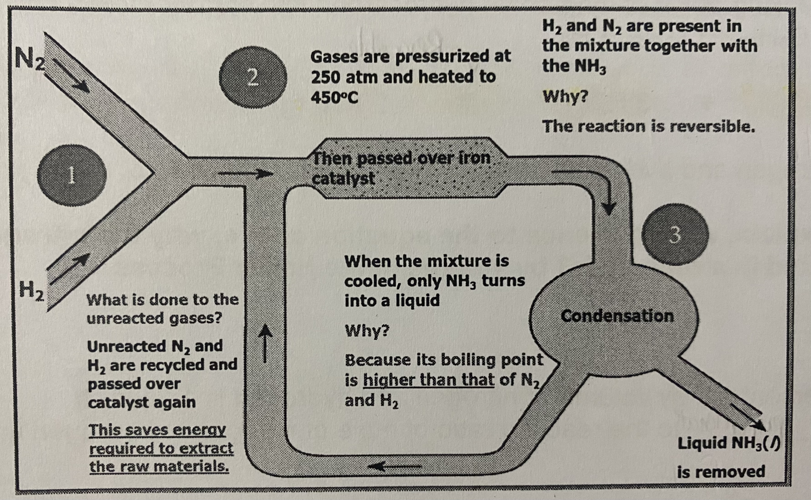

# 🏭 Ammonia

## Haber process

* Nitrogen is generally unreactive and does not react with hydrogen at room temperature and pressure
* Haber process that uses high temperature and high pressure and a catalyst to make the reaction possible
* Ammonia is a very useful chemical, with many uses from fertilisers to household cleaning solutions to explosives

### Starting materials

* Nitrogen obtained from fractional distillation of liquid air
* Hydrogen obtained from the cracking of petroleum, or electrolysis of water or reforming of methane

### Equation

$$N_2(g) + 3 H_2 (g) \rightleftharpoons  2NH_3 (g)$$

* The ratio of the percentage by volume of nitrogen and hydrogen is 1:3 which corresponds/ directly proportional to the reacting ratio of moles of nitrogen to hydrogen in the equation​

### Conditions

* Pressure of 250 atm
* Temperature of 450°C
* Finely divided iron catalyst to speed up the rate of reaction by lowering the activation energy, but no effect on the yield

### Reversible reaction

* A reversible reaction is a reaction that can be reversed
* The reaction of nitrogen and hydrogen to form ammonia ($$N_2(g) + 3 H_2 (g) \rightarrow  2NH_3 (g)$$) and the decomposition of ammonia to form nitrogen and hydrogen ($$2NH_3 (g)  \rightarrow N_2(g) + 3 H_2 (g)$$) happen at the same time
* The reaction will not reach 100% completion and the actual yield of the reaction would be less than 100%

### The industrial manufacture of ammonia

<figure><figcaption></figcaption></figure>

* Ammonia has a boiling point of -33°C, while nitrogen has a boiling point of -196°C, and hydrogen has a boiling point of -253°C, thus ammonia has a higher boiling point than nitrogen and hydrogen
* Since there is only 15% conversion of the nitrogen and the hydrogen to form ammonia and hence it is important to recycle the unreacted nitrogen and hydrogen gasses to increase yield
* The unreacted nitrogen and hydrogen are pumped back to the reacto for further reaction as the cost of obtaining nitrogen and hydrogen for this process is very high and hence not economically viable to discard the unreacted nitrogen and hydrogen gasses
* A mixture of ammonia, nitrogen and hydrogen is obtained. The mixture of gasses is cooled, and the ammonia gas formed condenses/ is cooled down and collected as a liquid

_What are the two reasons that unreacted nitrogen and hydrogen are fed back to the reactor?_

* To ensure that unreacted gasses are not wasted and fed back to the reactor to save energy because lesser raw material has to be produced
* To increase the overall yield of ammonia

### Increasing the yield/ speed of reaction

* The higher the pressure, the higher the % yield of ammonia. Higher pressure also increases the speed of reaction but maintaining high pressure is costly because expensive equipment is required
* The lower the temperature, the higher the % yield of ammonia, however, a lower temperature also results in a slower reaction, therefore a relatively high temperature of 450°C is used
* Despite conditions like high pressure and a relatively high temperature, the rate of reaction is still relatively slow, hence a catalyst is used to increase the rate of reaction
* However a lower temperature/ pressure has no effect on the **final** amount of ammonia produced because unreacted nitrogen and hydrogen are recycled back into the reactor until almost all of the hydrogen and nitrogen are reacted

### Laboratory preparation of ammonia

* Displacement of ammonia from its salt
  * $$2NH_4Cl(aq) + Ca(OH)_2 (aq) \rightarrow CaCl_2(aq) + 2NH_3(aq) + H_2O$$​
* Drying of ammonia
  * The common dehydrating agents such as $$H_2SO_4$$​ or $$CaCl_2$$cannot be used as they will react with ammonia
  * $$2NH_3 + H_2SO_4 \rightarrow (NH_4)_2SO_4$$
  * $$8NH_3 + CaCl_2 \rightarrow CaCl_2.8NH_3$$​
  * For drying, quicklime is used as it does not react with ammonia , but reacts with moisture/ water
  * $$CaO + H_2O \rightarrow Ca(OH)_2$$​

### Uses of ammonia

* The main use of ammonia is to manufacture nitrogen fertilisers, which increases the protein content for plants to ensure healthy plant growth
* The liming of soil is adding $$Ca(OH)_2$$​ or $$CaO$$​ (quicklime) to neutralise the acidity in the soil
* But liming of the soil and addition of nitrogen fertilisers should not be done at the same time, because the ammonium compounds will react with the calcium hydroxide to produce ammonia which will escape into the atmosphere
* This loss in ammonia from the fertiliser reduces the nitrogen content essential for healthy plant growth
* $$2NH_4NO_3 (aq) + Ca(OH)_2 (aq) \rightarrow NH_3 (g) + Ca(NO_3)_2 (aq) + H_2O (l)$$
* Ionic equation: $$NH_4 ^+(aq)+ OH^- (aq) \rightarrow NH_3 (g) + H_2O(l)$$​
