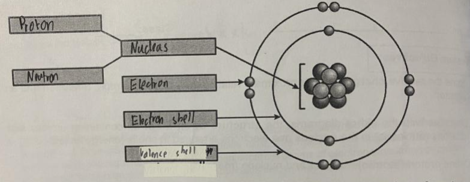

# ⚛ Atomic structure

* An atom is the smallest particles of an element/ fundamental unit of matter

## Structure

<figure><figcaption></figcaption></figure>

* At the centre of every atom is a small dense nucleus, which is composed of two subatomic particles known as protons (charge of +1) and neutrons (charge of 0)
* They are known as nucleoids
* A third subatomic particle known as the electron (charge of -1) orbits around the nucleus in energy levels that are often referred to as electron shell
* The inner shell (closest to the centre) can hold a maximum number of two electrons while the second and third shells can hold a maximum number of eight electrons each
* The outermost electron shell is known as the valence shell
* The mass of a proton and neutron is 1, while the mass of an electron is 1/1840, making it negligible

## Nuclide representation

* $$^a_bX$$​, where X is the chemical symbol of the element, a is the mass/ nucleon number and b is the atomic / proton number
* The proton number is the number in the nucleus of an atom
* The mass number the number of protons and neutrons in the atom
* The number of neutron by taking proton number - mass number
* Atoms are electrically neutral as the number of protons is equal to the number of neutrons

## Arrangement of electrons in an atom

* Sulfur has a proton number of 16, thus it has 16 electrons as the number of electrons is equal to the number of protons
* The first shell can only hold maximum of 2 electrons, thus it has 2
* The second shell can only hold a maximum of 6 electron, thus it has 8
* The remaining electrons are in the outermost shell, making it 6 electrons in the third shell
* The electronic configuration is 2.8.6

## Isotopes

* An isotope has different atoms of the same element which has the same number of protons but different numbers of neutrons
* Isotopes of the same elements have similar chemical properties (because they have the same number of electrons/ valence electrons), but different physical properties (rate of diffusion, density, electrical conductivity, melting/boiling point)&#x20;
* Formula to calculate relative isotopic mass: $$mass\char32 number \times \frac{percentage} {100} +mass\char32 number \times \frac{percentage} {100}$$

## Noble gas configuration

* Atoms of the group 0 element all have complete/ fully-filled electron shells, which is known as a noble gas/ stable electronic configuration
* Elements whose atoms have noble gas configuration are very stable and therefore unreactive, and are often described as chemically inert
