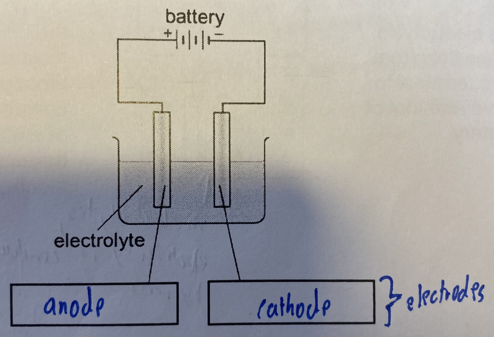

# 🏭 Electrolysis

* Electrolysis is the process of using electricity break down or decompose a compound (usually an ionic compound in the molten state or in aqueous solution or aqueous acid or aqueous alkali)
* Electrolysis takes place in a electrolytic cell

## Electrolytic cell

* An electrolytic cell is an arrangement of two electrodes connected to an electrical source (a battery or a cell) and placed into an electrolyte

<figure><figcaption></figcaption></figure>

* The battery acts as an electron pump and draws electrons away from the anode
  * The anode becomes positively charged
  * Electrons enter the positive terminal of the battery and are pumped out at the negative terminal
  * These electrons are supplied to the cathode, which becomes negatively charged


They are named after what the attract, not their charged

Anode attracts anions, cathode attracts cations


* The electrode conduct electricity
  * They are usual carbon (graphite) rods or metal plates
  * Oxidation takes place at the anode, where electrons leave the electrolyte
  * Reduction takes place at the cathode where electrons enter the electrolyte
* An electrolyte conducts electricity
  * Free moving ions allow electricity to flow through
  * Is a molten ionic compound or an aqueous solution
  * Is decomposed to form cations and anions
  * A strong electrolyte is a compound which completely ionize when dissolved in water, while a weak electrolyte is a compound which is partially ionised when dissolved in water
* In the wire/ electrodes, electricity is conducted by the movement of electrons from one end of the conductor to the other end, and metals/ graphite remain chemically unchanged
* Electrons flow from the positive terminal to the negative terminal of the battery
* In the electrolyte, electricity is conducted by the movement of ions across molten/ aqueous electrolyte and it is decomposed to form new substances
* At the anode, anions move to the anode and give up electrons, thus oxidation occurs
* At the cathode, cations move to the cathode and receive electrons at the cathode, thus reduction occurs
* The electrolyte has to be liquid/ in aqueous solution as in solid state, the oppositely charged ions are held in a giant ionic lattice structure by strong electrostatic forces of attraction, thus they cannot conduct electricity
* In molten/ aqueous state, the ions are free to move and carry charges and can conduct electricity as the electrostatic forces of attraction are overcomed

### Inert electrode

* Inert electrodes are as the chlorine is very reactive and react with the electrodes
* If reactive anodes like copper/ silver are used, it will ionise to form ions
* $$Cu (s) \rightarrow Cu^{2+} + 2e^-$$
* Anions in the solution will not be discharged

### Molten electrolyte

* Only the ions in the molten electrolyte will be discharged

### Cations

* Cations below hydrogen in the reactivity series (Copper, Silver, Gold) will be selectively discharged first
* $$H^+$$​ ions will be discharged next ($$2H^+ (aq) + 2e^- \rightarrow H_2(g)$$​)

### Anions

* Chloride, bromide and iodide ions will be selectively discharged IF THE ELECTROLYTE IS CONCENTRATED
* Else, the $$OH^-$$​ will be discharged ($$4OH^- (aq) \rightarrow 2H_2O (l) + O_2(g) + 4e^-$$​

## Electrolysis of certain compounds

### Concentrated sodium chloride

* $$Na^+$$​and $$H^+$$​ions are attracted to the cathode
* $$Cl^-$$​and $$OH^-$$​ions are attracted to the anode
* At the anode, $$Cl^-$$​ ions are selectively discharged first over $$OH^-$$ions as they are higher in concentration to form chlorine gas ($$2Cl^- (aq) \rightarrow Cl_2(g) + 2e^-$$​)
* $$OH^-$$​ions remain in the solution
* At the cathode, $$H^+$$​ ions are preferentially discharged over $$Na^+$$​ions to form hydrogen gas ($$2H^+ (aq) + 2e^- \rightarrow H_2(g)$$​)
* $$Na^+$$​ ions remain in the solution
* The resulting solution become alkaline because the remaining $$Na^+$$ and $$OH^-$$​ ions recombine to form sodium hydroxide, an alkali, causing the pH to increase from 7 to 13-14
* Equal volumes of hydrogen and chlorine gas are produced as for every 2 moles of electrons that are accepted by 2 moles of hydrogen ions to form 1 mole of hydrogen gas, 2 moles of electrons are lost by 2 moles of chloride ions to form 1 mole of chlorine gas.&#x20;
  * Since the mole ratio of chlorine gas and hydrogen gas is 1:1, it corresponds the the volume ratio of 1:1 and hence are equal
* However, chlorine gas is soluble in water, hence the amount collected is less than expected

### Copper(II) sulfate with reactive copper electrodes

* The ions present in the solution are $$Cu^{2+}, SO_4 ^{2-}, H^+, OH^-$$​
* At the anode, since copper is a reactive electrode, the anode ionises (dissolves) and decreases in mass ($$Cu (s) \rightarrow Cu^{2+} (aq) + 2e^-$$​)
* At the cathode, $$Cu^{2+}$$ions are preferentially discharged over $$H^+$$​ions to form copper metal ($$Cu^{2+} (aq) + 2e^- \rightarrow Cu(s)$$​), and the cathode increases in mass
* The $$Cu^{2+}$$​ions that are discharged at the cathode come mainly form the anode
* There is no net loss of $$Cu^{2+}$$​ ions from the solution, and the color and concentration of copper(II) sulfate remains unchanged
* This is because for every 1 mole of $$Cu^{2+}$$​ ions that is selectively discharged, it is replenished by 1 mole of copper atom that ionises at the the anode to form $$Cu^{2+}$$​ ions at the anode

## Cells

* A simple cell is a device that convert chemical energy into electrical energy
* It is also known as an electric cell
* A simple cell can be made by placing two different metals in an electrolyte
* Example: Zinc and copper in sulfuric acid
  * Zinc atoms, being more reactive than copper, give up electrons and goes into the solution as zinc ions
  * $$Zn(s) \rightarrow Zn^{2+} (Aq) + 2e^-$$
  * The electrode where electrons from which flow out is the negative electrode, thus zinc is the negative electrode
  * The electrons flow from the zinc electrode along the wire to the copper electrode
  * At the copper electrode, hydrogen ions from the electrolyte are selectively discharged, and take up electrons to form hydrogen gas
  * $$2H^+ (aq) + 2e^- \rightarrow H-2(g)$$​
  * Copper is the positive electrode
  * If the electrolyte is copper(II) sulfate, $$Cu^{2+}$$​ions will be discharged instead
  * The zinc electrode becomes smaller, and effervesce is also seen because zinc reacts with acid to form hydrogen gas
  * At the copper electrode, effervescence is seen as hydrogen gas is formed
  * Overall reaction: $$Zn(s) + 2H^+ (aq) \rightarrow Zn^{2+} (aq) + H_2 (aq)$$​
  * Oxidation and reduction occur to cause the flow of electrons, hence electrical energy is produced by redox reactions in a simple cell
* The more the difference in reactivity, the higher the voltage
* The flow of electrons is always form the more reactive metal to the less reactive metal
* The more reactive metal is the negative electrode and the less reactive metal is the the positive electrode

### Hydrogen fuel cell

* A fuel cell is a chemical cell in which the reactants are continuously supplied to produce electricity&#x20;
* At the cathode, oxygen is reduced to form hydroxide ions ($$O_2(g) + 2H_2O (l) + 4e^- \rightarrow 4OH^- (aq)$$​)
* At the anode, hydrogen is oxidized to form water ($$2H_2(g) + 4OH^- (aq) \rightarrow 4H_2O (l) + 4e^-$$​)
* Overall reaction: $$O_2 (g) + 2H_2 (g) \rightarrow 2H_2O (l)$$
* The reactants are not contained within the cell but are instead continuously supplied form an external reservoir​
* The reaction at the anode or negative terminal is said to be an oxidation process where electrons are produced when hydrogen gas reacts with hydroxide ions.&#x20;
  * These electrons flow to the cathode or positive electrode where a reduction process takes place when the oxygen accepts electrons to form hydroxide ions which will once again react with the hydrogen gas at the anode
* It is pollution free as only water produced form the reaction is harmless to the environment, and it is a renewable source of energy and produces a lot of heat energy
* But, there is not cheap source of extracting hydrogen, and it exists as a gas at room conditions and needs a large storage volume compared to other fuels
* We still need electricity to make hydrogen and this produces air polutants such as $$CO, NO_2$$​or  $$SO_2$$​

