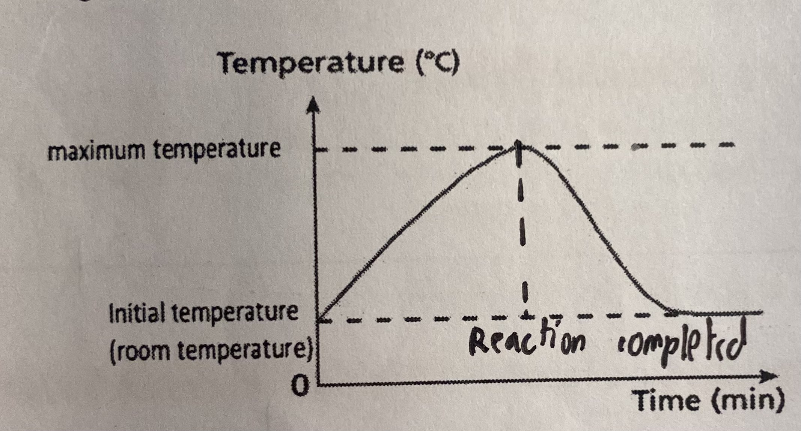
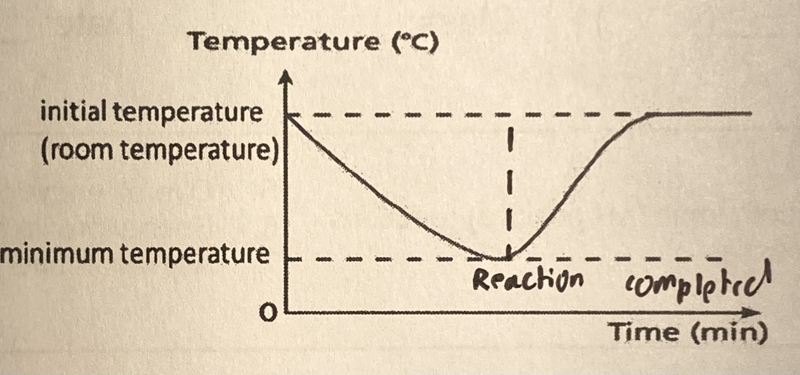
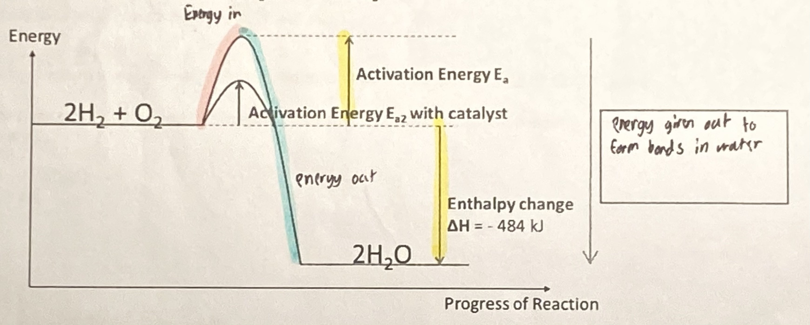
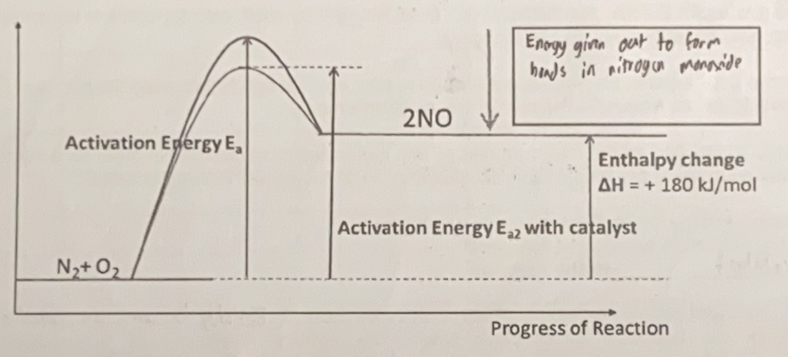

# 🔥 Energy changes

## Exothermic reactions

* An exothermic reaction is defined as a reaction that gives out heat to its surroundings
* This results in the increase in temperature of the surroundings (the reaction mixture, the container and the surrounding air)

<figure><figcaption>
Temperature-time graph of an exothermic reaction
</figcaption></figure>

* Examples of exothermic reactions
  * Combustion
  * Addition of sodium to water
  * Respiration
  * Neutralisation between any acid and alkali
  * Rusting of iron
  * Oxidation of metals
  * Dissolving sodium oxide and calcium oxide in water
* Exothermic processes are processes that involve bond forming only
  * Condensation
  * Freezing
  * $$CO_2 (g) \rightarrow CO_2(s)$$​
  * $$H + H \rightarrow H_2$$

## Endothermic reactions

* An endothermic reaction is defined as a reaction that absorbs heat form the surroundings
* This results in the decrease in temperature of the surroundings

<figure><figcaption>
Temperature-time graph of an endothermic reaction
</figcaption></figure>

* Examples of endothermic reactions
  * Thermal decomposition of metal carbonates ($$CaCo_3 \rightarrow CaO + CO_2$$​)
  * Photosynthesis&#x20;
  * The action of light on silver bromide to reduce silver ions to silver in photographic film
  * Electrolysis
* Endothermic processes are processes that involve bond breaking only
  * Boiling&#x20;
  * Melting
  * Sublimation
  * Dissolving some ionic compounds in water&#x20;

## Enthalpy change ($$\Delta H$$)

* The net amount of energy given out of absorbed in a reaction is t the enthalpy change of an reaction
  * Formula: $$\Delta H$$ = total energy absorbed for bond breaking - total energy given out for bond breaking
  * Unit: kJ/ kilojoules
* For exothermic reactions, the enthalpy change is negative
* For endothermic reactions, the enthalpy change is positive
* Whether a reaction is exothermic or endothermic depends on the net difference in the total energy taken in when bonds are broken and the total energy given out when bonds are formed
* Energy is the capacity to do work. More chemical changes are accompanied by a gain or a loss of energy
* The atoms or ions or molecules are held together by chemical bonds
* During chemical reactions, bonds in the reactants molecule  must be broken first before new bonds are formed in the product molecules
* Energy is absorbed to break bonds and energy is given out when bonds are made
* If the energy released during bond formation exceeds the energy absorbed during bond breaking, then the reaction is exothermic
* If more energy is absorbed to break bonds than the energy is released when the bonds are made, the reaction is endothermic

## Activation energy ($$E_a$$​)

* Activation energy is defined as the minimum energy molecules must posses in order for a chemical reaction to occur
* The activation energy is the total energy needed to break the bonds in the reactants
* The lower the activation energy, the faster the rate of reaction
* The activation energy can be lowered by adding a catalyst
* A catalyst alters the pathway of reaction where the activation energy of the reactions becomes lower&#x20;
* This results in more reaction particles having energy equal to or roe greater than the activation energy, hence more particles are able to collide with enough energy for reaction to occur
* This increases the frequency of effective collision between the reacting particles&#x20;

## Energy profile diagram

* Energy profile diagrams are used to show the enthalpy change and activation energy of a reaction
* It is a way of presenting the energy that occurs during a chemical reaction
* From the diagram
  * You can see that the activation energy acts as an energy barrier that must be overcome by the reactants before they can react to form products
  * You can compare the total energy content of its products with its reactants

<figure><figcaption>
Energy profile diagram of an exothermic reaction
</figcaption></figure>

* The reaction is exothermic because the total energy contents of the reactants, hydrogen and oxygen gas, are higher than the the total energy of the products

<figure><figcaption>
Energy profile diagram of an endothermic reaction
</figcaption></figure>

* The reaction is endothermic because the total energy contents of the reactants, hydrogen and oxygen gas, are lesser than the the total energy of the products
