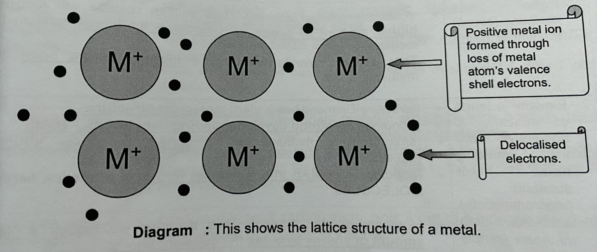

# ⚛ Ionic, covalent and metallic bonding

## Stability of atoms

* For atoms to be stable, they need to have a fully-filled valence shell, achieving stable noble gas configuration
* Most atoms are not stable, hence atoms will lose/ gain/ share electrons to achieve stability

## Formation of ions

* Metal atoms lose their valence electrons to achieve stable electronic configuration to form positive ions - Cations
  * Sodium atom loses 1 valence electron to form sodium ion
  * Since the number of protons is more than the number of electrons in the sodium ion, it has a positive charge
  * It has a fully filled valence shell and hence a stable electronic configuration
* Non-Metal atoms gain electrons to achieve stable electronic configuration to form negative ions - Anions
  * Chlorine atom gains 1 valence electron to form chloride ion
  * Since the number of electrons is more than the number of protons in the chlorine ion, it has a positive charge
  * It has a fully filled valence shell and hence a stable electronic configuration
* All ions are stable with full-filled valence shells

| Similarities                                                 | Differences                                                                  |
| ------------------------------------------------------------ | ---------------------------------------------------------------------------- |
| Both are charged particles                                   | Anion - Negative, Cation - Positive                                          |
|  Fully-filled valence shell/ stable electronic configuration | Anion - Gain electrons to form anion, Cation - lose electrons to form cation |
| Different number of electrons form their protons             | Anion - Non-metal atom, Cation - Metal atom                                  |
|                                                              | Anion - More electrons, Cation - Lesser electrons                            |

## Formation of ionic compounds

* When metallic elements react with non-metallic elements, the metal atom loses electrons to form positive ion while the non-metal atom gains electrons to form negative ions
* The oppositely charged ions are attracted to each other by strong electrostatic forces of attraction to form ionic bonds
* The compound is therefore referred to as an ionic compound

_I am not covering dot and cross diagram, if you can't figure it out skill issue tbh_

## Structure and bonding of ionic compound

<figure><figcaption></figcaption></figure>

* (Structure) It has a **giant ionic lattice structure**
* (Bonding) with strong **electrostatic forces of attraction** between **oppositely charged ions**

### Physical properties

* High melting and boiling point
  * It has a giant ionic lattice structure
  * with strong electrostatic forces of attraction between oppositely charged ions
  * During melting/ boiling, a lot of heat energy is needed to overcome the forces of attractions between the oppositely charged ions
* Does not conduct electricity in solid state
  * In solid state, oppositely charged ions are held by strong electrostatic forces of attraction in rigid lattice structure
  * Ions are unable to move to carry electric charges, thus unable to conduct electricity
* Conducts electricity in molten and aqueous state
  * In molten and aqueous state, the rigid lattice structure is broken down
  * Ions are able to move/ are mobile to carry electric charges and conduct electricity
* Soluble in water
  * Water molecules weakens the electrostatic forces of attraction between the ions
  * and thus separate the positive ions form the negative ions
  * Causing the rigid lattice structure to break down and dissolve in water
* Insoluble in organic solvent (e.g. alcohol)
* Brittle

## Covalent bonding

* When two or more non-metal atoms react, their atoms share electrons to form a covalent bond
* The atoms may be of the same element or different elements&#x20;
* The atoms come close together so their valence shells overlap
* They then share pairs of electrons to obtain the electronic configuration of the noble gas that is closest to them in the periodic table
* The substance is referred to as a covalent substance/ molecule

_I am also not going to go through how to draw dot and cross diagram_

## Structure and bonding of a simple covalent substance

<figure><figcaption></figcaption></figure>

* (Structure) It has a **simple molecular structure**
* (Bonding) With weak **intermolecular forces of attraction** between the **molecules**, but strong **covalent bonds** between the **atoms** within the molecule

### **Physical properties**

* Low melting and boiling point
  * It has a simple molecular structure
  * With weak intermolecular forces of attraction between the molecules
  * During melting/ boiling, a little amount of heat energy is needed to overcome the forces of attraction between the molecules
* Does not conduct electricity in any state
  * The simple covalent substance exist as molecules and thus there are not mobile charged particles like ions and electrons to carry charges
* Insoluble in water
* Soluble in organic solvent (e.g. alcohol) except sugar or acids

## Structure and bonding of diamond

<figure><figcaption></figcaption></figure>

* (Structure) It has a **giant molecular structure**
* (Bonding) With numerous and strong **covalent bonds** between the **atoms**

### **Physical properties**

* High melting and boiling point
  * It has a giant molecular structure&#x20;
  * With numerous and strong covalent bonds between the atoms
  * During melting/ boiling, a lot of heat energy is needed to break the bonds
* Does not conduct electricity in any state
  * All the valence electrons are used up in bonding. There are no mobile electrons to carry electric charges
* Hard
  * Due to the numerous and strong covalent bonds between the atoms in a rigid tetrahedral arrangement, atoms cannot slide when force is applied
* Insoluble in water and organic solvent

## Structure and bonding of graphite

<figure><figcaption></figcaption></figure>

* (Structure) It has a **giant molecular structure**
* (Bonding)  Within the layer, there are numerous and strong **covalent bonds between the atoms**. Between the layers of atoms, there are weak intermolecular force of attraction that hold the layers together

### Physical properties

* High melting and boiling point
  * It has a giant molecular structure
  * With numerous and strong covalent bonds between the atoms
  * During melting/ boiling, a lot of heat energy is needed to break the bons
* Conducts electricity in any state
  * Only 3 out of 4 valence electrons in each carbon atom are involved in bonding in graphite
  * The fourth electron is delocalized
  * Graphite can conduct electricity in solid state due to the the presence of mobile delocalised electrons which are able to carry electrical charges within the layers
* Soft and slippery
  * Due to weak intermolecular forces between the layers of atoms
  * Layers of atoms can slide easily when force is applied
* Insoluble in water and organic solved (e.g. alcohol)

## Metallic bonding

* Metallic bonding is found only in metals

<figure><figcaption></figcaption></figure>

* (Structure) It has a **giant metallic structure** made up of orderly arrange atoms
* (Bonding) With strong electrostatic forces of attraction between positive ions and the surrounding 'sea' of mobile delocalized ions

### Physical properties

* High melting and boiling point
  * It has a giant metallic structure
  * With strong electrostatic forces of attraction between positive ions and the surrounding sea of mobile delocalized electrons
  * During melting/ boiling, a lot of heat energy is needed to overcome the forces of attraction
* Conducts electricity in any state
  * Each metal atom give up electrons to become a positive ion
  * The mobile delocalized electrons are able to carry electrical charged
* Malleable/ ductile
  * Because the atoms in a metal are closely packed and orderly arranged
  * Layers of atoms can slide easily when force is applied
* High density
  * Atoms are packed closely together
* Insoluble in water and organic solvents (e.g alcohol)
