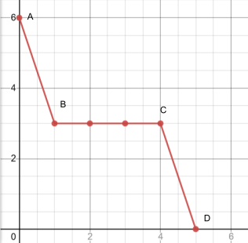
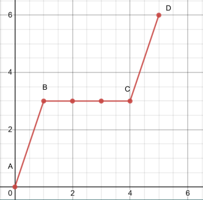
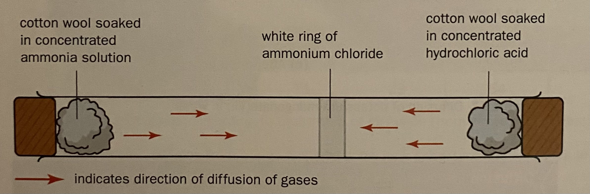
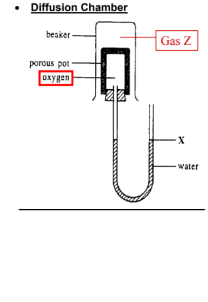

# 🧪 Kinetic Particle Theory

* The kinetic particle theory tells us that everything around us is made up of very tiny particles that are in constant and random motion

## States of matter

| Solid                | Liquid               | Gas               |
| -------------------- | -------------------- | ----------------- |
| Fixed shape          | No fixed shape       | No fixed shape    |
| Fixed volume         | Fixed volume         | No fixed volume   |
| Cannot be compressed | Cannot be compressed | Can be compressed |

### Solids

* Fixed shape as particles
  * Are closely packed in an orderly manner
  * Are held together by strong forces of attraction
  * Have enough kinetic energy to only vibrate and rotate about their fixed positions
  * Cannot move about freely
* Fixed volume
  * Cannot be compressed as its particles are already very close to one another -> Fixed volume

### Liquid

* No fixed shape as particles
  * Are arranged in a disorderly manner
  * have weaker forces of attraction than solids
  * have more kinetic energy than particles of the same substances in solid state and not held in fixed positions
  * Can move freely throughout the liquid
* Fixed volume
  * Particles are further away from one another than that of a solid, but are still packed quite closely together, and cannot be compressed -> Fixed volume

### Gas

* No fixed shape as particles
  * Are spread far apart from one another
  * Have weaker forces of attraction than particles of a liquid
  * Have a lot of kinetic energy and are not held in fixed positions
  * Can move about rapidly in any direction
* No fixed volume
  * Particles have a lot more space between them as compared to a solid or a liquid
  * The large space between the particles allows the gas to be easily compressed when pressure is applied

## Changes in the state of matter and the kinetic particle theory

### Melting

* Meling is the process by which a substance changes from a solid to a liquid
* The temperature at which a solid becomes a liquid is called the melting point
* Different substances have different melting points

<figure><figcaption></figcaption></figure>

* A-B: Solid heats up
  * The temperature of the solid increases until it reaches its melting point, B
  * Heat energy is absorbed by the particles of the solid, which is converted into kinetic energy
  * The particles start to vibrate faster about their fixed positions
  * At B, it starts to melt
* B-C: Solid melts
  * During melting, the temperature of the solid does not rise even though heating continues
  * Heat energy taken in by particles of the solid is used to overcome the forces of attraction holding the particles in fixed positions
  * The particles begin to break away from their fixed positions
  * A mixture of solid and liquid exists at this stage
* C-D: Liquid heats up
  * The particles are no longer in their fixed positions
  * At C, all of the solid has melted
  * The particles are no longer in their fixed positions
  * The temperature of the liquid continues to rise as heating continues

### Freezing

* Freezing is a process by which a substance changes from a liquid to a solid
* The temperature at which a liquid becomes a solid is called its freezing point
* A pure substance freezes at the same temperature

<figure><figcaption></figcaption></figure>

* A-B: Liquid cools
  * Energy is given out by the particles of the liquid
  * The particles lose kinetic energy and begin to move more slowly
  * The temperature of the liquid drops until it reaches freezing point, B
  * At B, the liquid starts to freeze
* B-C: Liquid freezes
  * When the temperature is low enough, the particles no longer have enough energy to move freely
  * The particles start to settle into their fixed positions
  * During freezing, the temperature of the liquid remains the same even though cooling continues
  * Heat energy is released as the particles of the liquid are attracted to each other to form a solid. This heat energy is given out to the surroundings
  * A mixture of solid and liquid exists at this stage
* C-D: Solid cools
  * At point C, all of the liquid has solidified
  * The temperature of the solid drops as cooling continues

### Boiling

* Boiling the process by which a substance changes from a liquid to a gas at the boiling temperature of the substance
* The temperature at which a liquid boils is called its boiling point
* Different substance have different boiling points

<figure><figcaption></figcaption></figure>

* A-B: Liquid heats up
  * Heat energy is absorbed by particles of the liquid
  * The heat energy is converted to kinetic energy
  * The particles start to move faster as temperature rises
  * The temperature of the liquid increases until it reaches its boiling point, B
  * At B, The liquid starts to boil
* B-C: Liquid starts to boil
  * When the temperature is high enough, the particles have enough energy to overcome the forces of attraction holding them together
  * During boiling, the temperature remains the same although heating continues
  * Heat energy taken in by the particles of the liquid is used to overcome the forces of attraction between the particles
  * A mixture of liquid and solid exist at this stage
* C-D: Gas heats up
  * At C, all of the liquid has boiled
  * The temperature of the gas rises as heating continues
* Bubbles of gas are seen when a liquid boils
  * They are formed when the liquid changes to a gas
  * They also consist of other gases dissolved in the liquid
  * The bubbles rise to the surface and escape into the air

### Evaporation

* Evaporation is the process by which a liquid changes to a gas at a temperature lower than its boiling point
* Evaporation occurs because some particles have enough energy to escape as a gas from the surface of the liquid
* Liquids that evaporate quickly at room temperature are called volatile liquids, and they usually have boiling points just above room temperature

#### Differences between evaporation and boiling

| Evaporation                                | Boiling                      |
| ------------------------------------------ | ---------------------------- |
| Occurs at temperatures below boiling point | Occurs only at boiling point |
| Occurs only at the surface of the liquid   | Occurs throughout the liquid |
| Occurs slowly                              | Occurs rapidly               |

### Condensation

* Condensation is the process by which a gas changes to a solid
* When water vapor touches a cold surface, condensation occurs and liquid water is obtained
* Heat energy is given out by the gas particles during condensation
* As the temperature drops, the gas particles lose energy and move more slowly
* Eventually, the particles becomes slow enough to change to a liquid

### Sublimation

* The process by which a solid changes directly to a gas without going through the liquid state is called sublimation
* Sublimation occurs because particles at the surface of the solid have enough energy to break away from the solid and escape as a gas
* Dry ice is sued for industrial refrigeration and transferring frozen food as it keeps them very cold and changes directly to a gas without leaving any liquid behind

## Diffusion

* Diffusion is the process whereby particles move form a region of higher concentration to a region of lower concentration, until both regions are homogeneous/ particles are uniformly distributed

### Molecular mass

* Gasses with a lower molecular mass will diffuse faster than those with a higher molecular mass

<figure><figcaption></figcaption></figure>

* When ammonia gas from the concentrated ammonia solution and hydrogen chloride gas from the hydrochloric acid react, a white ring of ammonium chloride is formed
* Ammonia has a lower Mr of 17, while hydrogen chloride has a higher Mr, thus ammonia will have a higher rate of diffusion than hydrogen chloride, and will diffuse faster than hydrogen chloride
* The white ring will then be formed closer to the hydrochloric acid

#### Diffusion chamber

<figure><figcaption></figcaption></figure>

* In a diffusion chamber, when gas Z is less dense (due to lower Mr) than oxygen, gas Z will diffuse into the porous pot faster than the oxygen diffusing out -> higher amount of gas inside the porous pot ->higher pressure in the porous pot ->  pushes the water level down and the level of X increases
* In a diffusion chamber, when gas Z is more dense (due to higher Mr) than oxygen, oxygen will diffuse out of the porous pot faster than gaz Z diffusing in -> there is a lower amount of gas in the porous pot -> lower pressure in the porous pot -> Level of X increases

### Temperature

* The higher the temperature, the higher the rate of diffusion
* This is because particles gain more energy as temperature increases, and can move faster, increasing the rate of diffusion

## Expansion and contraction

* When a substance is heated
  * the particles move faster and further apart
  * The space in between particles increases
  * Therefore the substance expands
* When a substance is cooled
  * The particles move slower and closer together
  * The space in between particles decreases
  * Therefore the substance contracts

## Density

* For the same volume, gas has the least amount of particles than solid or liquid, therefore it has the lowest density
