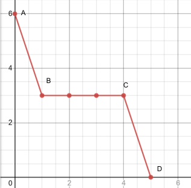
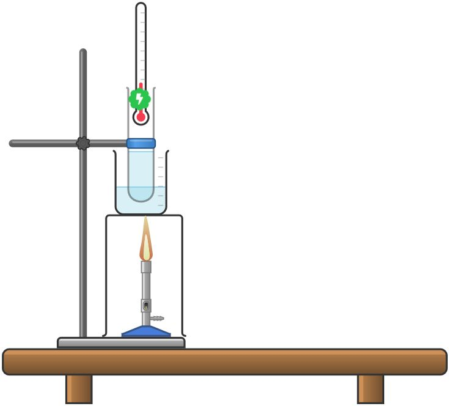
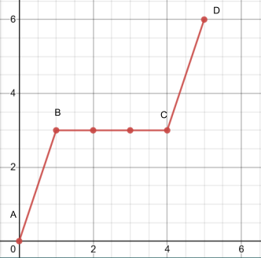
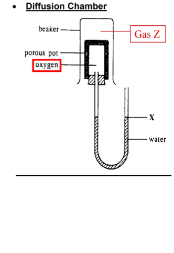

# Kinetic Particle Theory

## States of matter

* Matter is anything that has mass and occupies space
* Exists as a solid liquid or gas, known as states of matter
* Changes in states of matter is the result of energy being gained or lost from the surroundings

| Solid                | Liquid               | Gas               |
| -------------------- | -------------------- | ----------------- |
| Fixed shape          | No Fixed shape       | No fixed shape    |
| Fixed volume         | Fixed volume         | No Fixed volume   |
| Cannot be compressed | Cannot be compressed | Can be compressed |

## Kinetic particle theory

* The kinetic particle theory states that all matter is made up of tiny particles in constant and random motion

### Solids

* Its particles are closely packed in an orderly arrangement together
* Particles are held together by very strong forces of attraction
* Particles only have enough kinetic energy to only vibrate and rotate in fixed positions
* Particles cannot move about freely
* Hence they have a fixed shape
* Particles are already very close to each other -> cannot be compressed -> fixed volumr

### Liquids

* Its particles are arranged in a disorderly manner
* Particles have weaker forces of attraction than solids
* Particles have more kinetic energy than solid particles of the same substance
* Particles can move about freely throughout the liquid
* Hence, it does not have a fixed shape
* Particles can roll and slide past each other -> liquids can flow
* Even though particles are spaced further apart than that of solids, they are still packed quite closely -> cannot be compressed -> fixed volume

### Gases

* Particles are spread far apart form one another
* Particles have weaker forces of attraction than liquids
* Particles have a lot kinetic energy and are not held in fixed positions
* Particles can move about rapidly in any direction
* Hence, it does not have a fixed shape
* A lot of space between particles compared to liquids and solids -> easily compressed when pressure is applied -> no fixed volume

## Changes in state of matter and kinetic particle theory

* Particles of matter are in constant random motion -> they have kinetic energy
* Gases have the most kinetic energy, liquids have more kinetic energy than solids, and solids have the least kinetic energy
* When matter is heated or cooled, the energy absorbs or released changes the kinetic energy of the particles, thus there is a change in the state of matter
* Changes are reversible

### Melting

* Melting is the process where a substance changes from a solid to a liquid
* Melting point is the temperature at which a solid becomes a liquid
* Heat energy is absorbed by the solid particles, which is converted to kinetic energy, causing the particles to vibrate faster in their fixed positions
* When the temperature is high enough, the particles have enough kinetic energy to overcome the forces of attraction between them, and start to break away from their fixed position
* Particles are no longer in their fixed positions, and the substance is now a liquid. Particles are free to move about throughout the liquid

#### Set-up to observe the melting point of a substance

<figure><figcaption></figcaption></figure>

#### Melting curve of a substance

<figure><figcaption></figcaption></figure>

* A-B: Solid heats up
  * Temperature of solid increases until it reaches its melting point (B)
* B-C: Solid melts
  * During melting, the temperature of the solid does not rise even though heating continues
  * Energy taken in by particles of the solid are used to overcome the forces of attraction holding the particles in fixed position
  * A mixture of solid and liquid exists at this stage
* C-D: Liquid heats up
  * At C, all the solids have melted and the temperature of the liquid continues to rise as heating continues

### Freezing

* Freezing is the process in which a substance changes from a liquid to a solid
* Freezing point is the temperature where the liquid becomes a solid
* Energy is given out by the liquid particles, and the particles lose kinetic energy and begin to move more slowly
* When the temperature is low enough, the particles no longer have enough energy to move freely, and start to settle in their fixed position
* All the particles have settled into their fixed positions, and the substance is now a solid. The particles can only vibrate about their fixed positions

#### Cooling curve of freezing

<figure><figcaption></figcaption></figure>

* A-B: Liquid cools
  * The temperature of the substance drops till it has reached its freezing point (B0
  * At B, it starts to freeze
* B-C: Liquid freezes
  * During freezing, the temperature of the liquid remains constant even though cooling continues
  * The heat energy is released to the surroundings as the particles are attracted to each other to form a solid
  * A mixture of solid and liquid exist at this stage
* C-D: Solid cools
  * At D, all of the liquid substance has become solid and the temperature drops as cooling continues

### Boiling

* Boiling is the process in which a substance changes form a liquid to a gas at the boiling temperature of the substance
* Boiling point is the temperature at which a liquid boils
* Heat energy is absorbed by the particles of the liquid, and the heat energy is converted to kinetic energy and the particles start to move faster as temperature rises
* When the temperature is high enough, the particles have enough energy to overcome the forces of attraction holding them together
* The particles are spread far apart and the substance is now a gas and it can move about in any direction

#### Set-up to observe the boiling point of a substance

<figure><figcaption></figcaption></figure>

#### Heating curve of boiling

<figure><figcaption></figcaption></figure>

* A-B: Liquid heats up
  * The temperature of the liquid particle increases until it reaches the boiling point (B)
  * At B, the substance starts to boil
* B-C: Liquid boils
  * During boiling, there is no change in temperature although the liquid is still being heated
  * Heat energy absorbed here is being used to overcome the forces of attraction
  * A mixture of liquid and gas exist here
* C-D: Gas heats up
  * At C, all the liquid has boiled and the temperature of the gas increases as heating continues
* Observation during boiling: Bubbles of gas are seen
  * These are formed when a liquid changes into a gas and also consists of other gases dissolved in the liquid
  * They rise up to the surface and escape into the air

### Evaporation

* Evaporation is the process by which a liquid changes to a gas at a temperature lower than its boiling point
* Occurs only because some particles as the surface of the liquid have enough energy to evaporate as a gas
* Liquids that evaporate quickly at room temperature are known as volatile liquids, and have boiling points just above room temperature

#### Differences between boiling and evaporation

| Boiling                      | Evaporation                                                           |
| ---------------------------- | --------------------------------------------------------------------- |
| Only occurs at boiling point | Occurs at any temperature blow boiling point and above freezing point |
| Occurs throughout the liquid | Occurs only at the surface of the liquid                              |
| Occurs rapidly               | Occurs slowly                                                         |

### Condensation

* Condensation is the process in which a gas changes to a liquid
* When a gaseous substance touches a cooler surface, condensation occurs and liquid is obtained
* Heat energy is given out during condensation by gas particles&#x20;
* As the temperature drops, the gas particles lose kinetic energy and move more slowly
* They move slowly enough to form a liquid

### Sublimation

* Sublimation is the process where a solid changes directly into a gas without going through the liquid state
* Occurs because particles at the surface of the solid have enough energy to break away form the solid and escape as a gas
* Useful as&#x20;
  * Dry ice is used for industrial refrigeration and transporting frozen food
  * Especially good for refrigerating food as it keeps them very cold and changes directly into a gas without leaving any liquid behind

## Diffusion

* Diffusion is the net movement of particle form a region of high concentration to a region of lower concentration
* Provides evidence for the kinetic particle theory
* Rate of diffusion depends on the molecular mass, the higher the mass, the slower the rate of diffusion
  * In a tube with cotton wool with concentrated ammonia and hydrochloric acid, there will be a white ring close to the hydrochloric acid as ammonia has a lower molecular mass than hydrochloric acid
* Rate of diffusion also depends on temperature, the higher the temperature, the higher the rate of diffusion
* Diffusion stops when the two regions are homogeneous, and the particles are evenly distributed

### Diffusion chamber

<figure><figcaption></figcaption></figure>

* In a diffuson chamber of gas Z which is less dense (due to lower Mr) than oxygen, Gas Z will diffuse into the prorous pot faster than oxygen diffusing out -> there is a higher amount of gas in the proous pot -> higher pressure in the porous pot -> pushes the water level down and the level of X increases
* In a diffusion chamber of gas Z is more dense (due to higher Mr) than oxygen, oxygen will diffuse out of the porous pot faster than gas Z diffusing in -> there is a lower amount of gas in the porous pot -> lower pressure in the porous pot -> level of X decreases

## Expansion and contraction

* When a substance is heated, the particles move faster and further apart, the space inbetween particles increases and therefore the substance expands
* When a substance is cooled, the particles move slower and close together, the space inbetween particles deacreases, thereforce the substance contracts

## Density

* For the smae volume, gasses have th least amount of particle than solids or liquids, therefore it ahs the lowest density
