# 🏭 Macromolecules

* A polymer or a macromolecule is a very large molecule that is made up of a large number of small molecules (monomers)
* A monomer is a small molecule that can by joined together to form a large long-chain molecule
* Polymerisation is the process of joining together a large number of small molecules (monomers) to form a polymer or macromolecule

## Addition polymerisation

* Addition polymerisation is a reaction where large number of unsaturated small molecules (monomers) join together to form a polymer or macromolecule, without the elimination of small molecules or atoms
* Conditions
  * High pressure (1000 atm)
  * High temperature (200°C)
  * Catalyst
* They have the same empirical formula but different structural formula
* Polyethene does not react with bromine in an addition reaction, unlike ethene

<figure>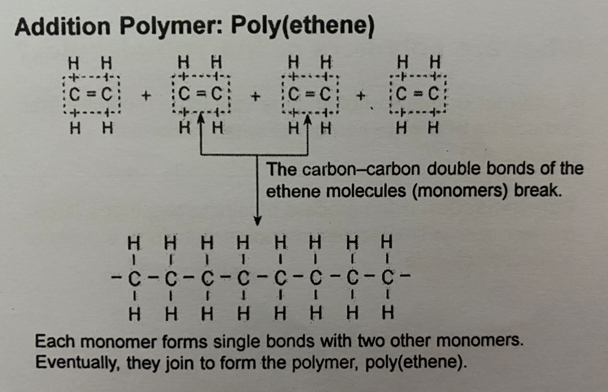<figcaption></figcaption></figure>


Get the monomer into the form of of 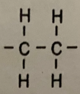

Break the carbon- carbon double bonds in each of the monomers and join them together


<figure>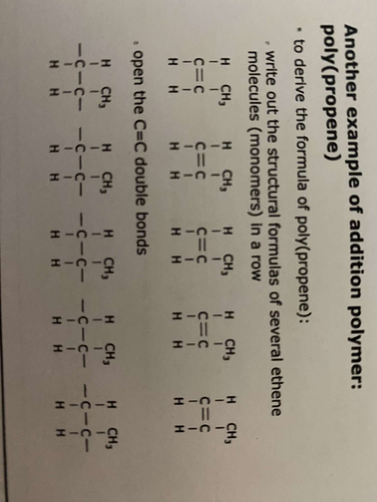<figcaption></figcaption></figure>

 

<figure>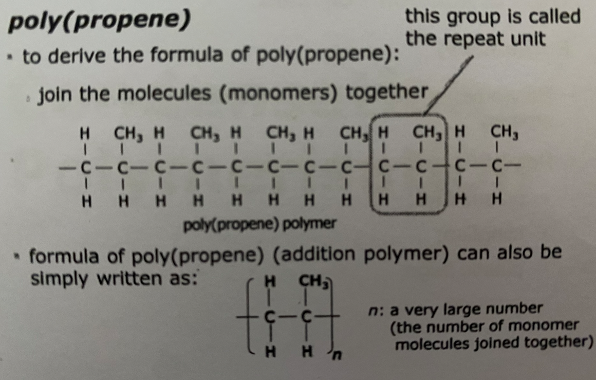<figcaption></figcaption></figure>

### Repeat unit

<figure>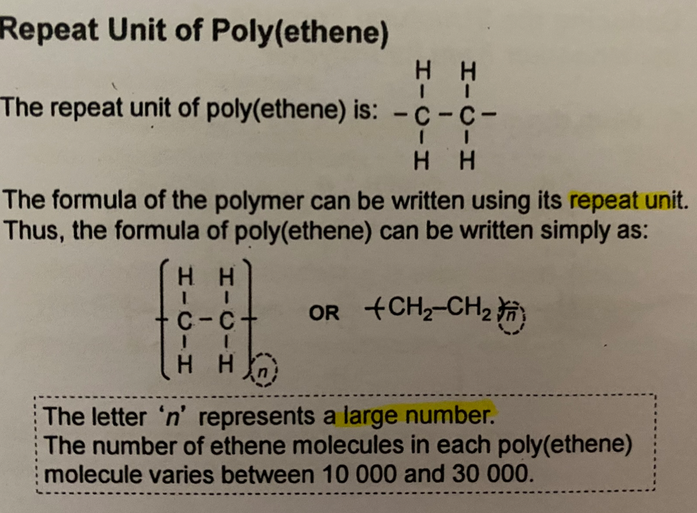<figcaption></figcaption></figure>

### Deducing the structural formula of a monomer from its polymer

* Find the repeat unit
* Change the single carbon-carbon bond into a double carbon-carbon bond

### Uses of addition polymers

* Polyethene can be molded into different shapes
  * Used to make plastic toys, cling film, plastic bags and buckets
* Polystyrene is hard light and brittle, and is used to make disposable containers
* Polyvinyl chloride (PVC) is used to make pipes, raincoats, floor maths and thin gloves
* Teflon is used in non-stick frying pans
* Perspex is used fo the windscreen of cars

## Condensation polymerisation

* Condensation polymerisation is a reaction where large numbers of small molecules with two functional groups join together to form a large molecule. Small molecules or atoms are eliminated during the reaction

### Nylon - A polyamide

* The first synthetic (man-made) fibre made by condensation polymerisation
* Has dicarboxylic acid and a diamine as it monomers

<figure>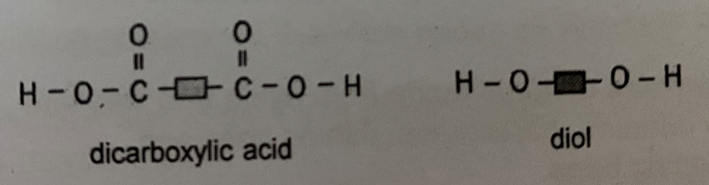<figcaption></figcaption></figure>


The boxes can be any molecule inside


<figure>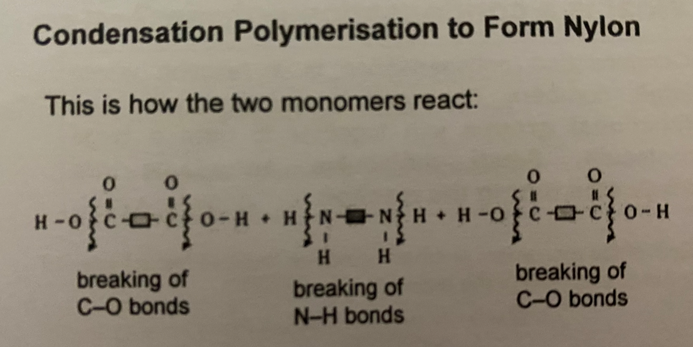<figcaption></figcaption></figure>


Remove OH from the acid, and remove H from the diamine, and join them together (but not always, be sure to look out for the linkages)


<figure>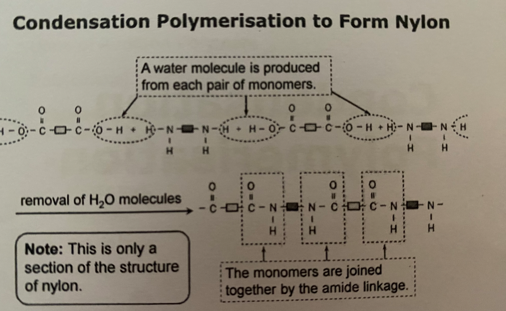<figcaption></figcaption></figure>


It may not always be OH and H ions, it may be Cl ions

Always look out for the amide/ ethene linkages to be sure

**Applies to both polyamide and polyethene**


* Water is formed as a byproduct
* Sometimes, HCl may be formed instead of water

<figure><figcaption></figcaption></figure>

### Terylene - A polyethene

* Another example of a condensation polymer
* Made from dicarboxylic acid and a diol

<figure>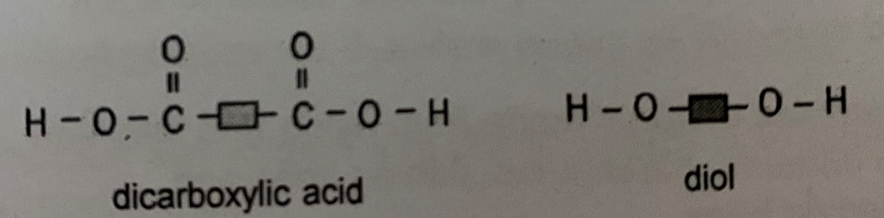<figcaption></figcaption></figure>

<figure>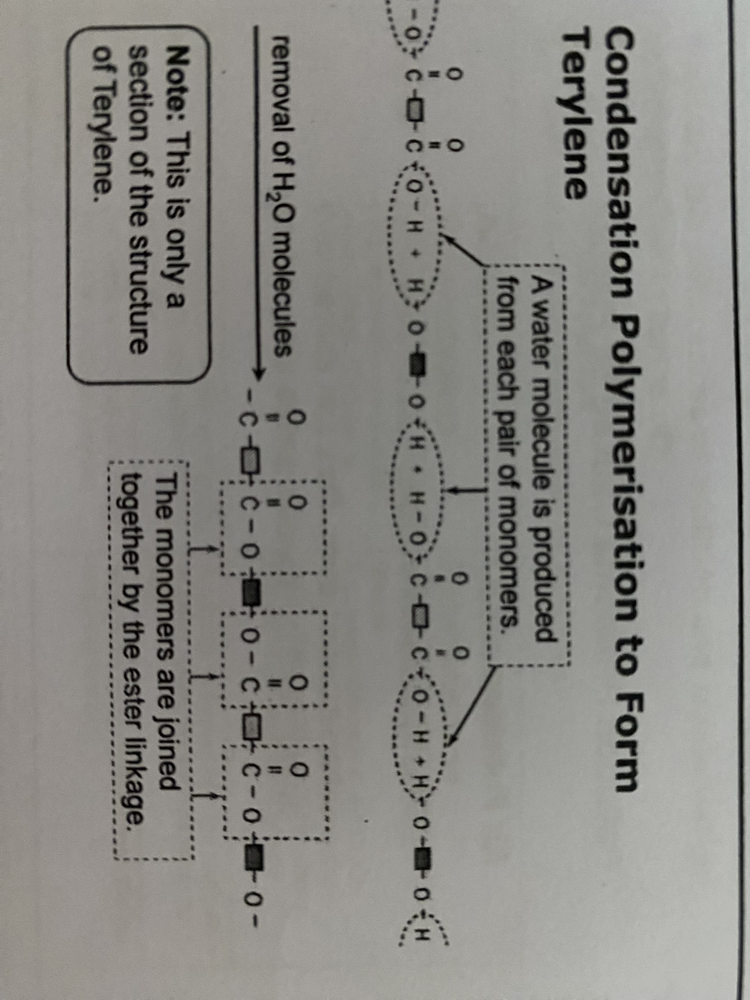<figcaption></figcaption></figure>


Remove OH from acid, H from alcohol (but not always, be sure to look out for the linkages)


<figure>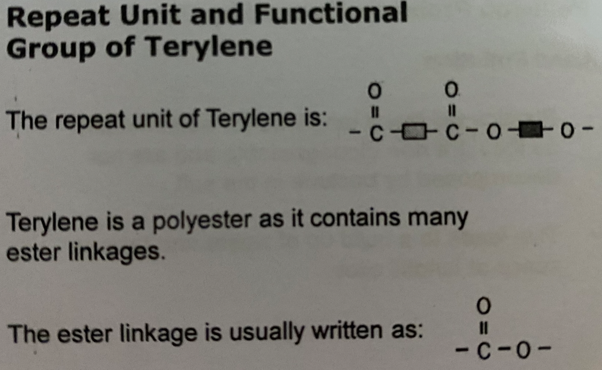<figcaption></figcaption></figure>

## Uses

* Synthetic or man-made fibers are usually plastics which have been spun into threads
* Terylene and nylon are best known examples of synthetic fibres
* Terylene and nylon are the best known example of synthetic fibres
* Clothes made from these fibres are shrink-proof and crease-proof, and are easier to wash and dry
* They are strong, and can be drawn into long thin strands without breaking, thus they are used to make fishing lines
* Examples of items made from nylon and terylene are curtains, parachutes, fishing lines and sleeping bags

## Advantages

* Relatively cheap
* Easily moulded&#x20;
* Light, tough and waterproof
* Durable (resistant to decay, rusting and chemical attack

## Disadvantages

### Land pollution

* Plastics will last a long time (or accumulate) as they are non-biodegradable and are not decomposed by bacterial in the soil
* This leads to a buildup of waste and take up space at landfill sites

### Air pollution

* Plastics are flammable
* When they are burnt, fires can spread very quickly and poisonous gasses are produced

### Water pollution

* Plastics thrown into the sea endangers marine animals, as they mistake plastics for food and choke on them
* Plastics can clog up rivers and drains, which may become breeding ground for mosquitos

## Proper disposal

* Many plastics produce poisonous gases such as carbon monoxide upon incineration
* For example, PVC produces hydrogen chloride gas upon burning
* Burning plastics thus will cause air pollution
* The best way to deal with plastic objects is to reuse or recycle them
