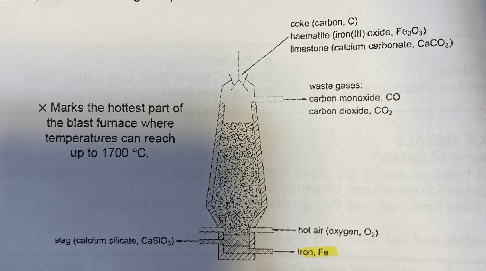

# 🏭 Metals

## Structure and bonding of metals

<figure><figcaption></figcaption></figure>

* It has a giant metallic structure
* With strong electrostatic forces of attraction between positive ions and the surrounding sea of mobile delocalized electrons

### Physical properties

* HIgh melting and boiling point
  * It has a giant metallic structure
  * With strong electrostatic forces of attraction between positive ions and the surrounding sea of mobile delocalised electrons
  * During melting/ boiling a lot of heat energy is needed to overcome the forces of attraction
* Conducts electricity in any state
  * Each metal atom gives up electrons to become a positive ions
  * The mobile delocalised electrons are able to carry electrical charges
* Malleable and ductile
  * Because atoms in a metal are closely packed and orderly arranged, layers of atoms can slide easily when force is applied
* High density
  * Atoms are packed closely together
* Insoluble in water and organic solvent

### Alloys

* Alloys are mixtures of a metal with other elements

<figure><figcaption></figcaption></figure>

* Pure metals are softer than alloys because layers of atoms can slide over one another when force is applied
* In an alloy, atoms of **different sizes  disrupt the orderly arrangement of atoms in a pure metal, and prevent layers o atoms from slider over each other**
* Stronger and harder than pure metals
* More corrosion resistant than pure metals
* More presentable as the metallic lustre is preserved
* Lower melting point than pure metals

## The reactivity series

| Metal                      | Reaction with water or steam                                                         | Metal with acid                    |
| -------------------------- | ------------------------------------------------------------------------------------ | ---------------------------------- |
| Potassium, sodium, calcium | React with cold water and steam violently/ explosively                               | Violent reaction with dilute acids |
| Magnesium                  | React violently/ explosively with steam, slowly with cold water                      | Reacts rapidly with dilute acids   |
| **Zinc, Iron**             | 
<strong>No reaction with water</strong> <strong>Reacts with steam</strong>
 | **Reacts with dilute acids**       |
| Lead, copper silver        | No reaction with water or steam                                                      | No reaction with acids             |

* Metals beyond Zinc and iron do not react with anything
* Metals beyond magnesium can be reduced with hydrogen and carbon
* Metals that are not in group 1 have carbonates that can be decomposed with increasing ease
* The more the number of shells, the weaker the electrostatic forces, causing the reaction to be stronger
* Group I metals have only 1 valence electron, making it easy to remove and highly reactive


**P**lease **S**end **C**ats **M**onkeys **Z**ebras **I**n **L**arge **H**ired **C**ages **S**incere **G**ratitude


* Metal + Water -> Metal hydroxide + Hydrogen gas
* Metal + Steam -> Metal oxide + Hydrogen gas
* Metal + Acid -> Salt + hydrogen gas


WOH SO


## Reactions

### Displacement

* A more reactive metal can displace a less reactive metal from its solution
* $$Zn(s) + CuSO_4(aq) \rightarrow Cu(s) + ZnSO_4(aq)$$
* Zinc is more reactive than copper, and will displace copper form its solution
* The blue solution turns colourless, and a reddish-brown solid is formed in the solution
* A more reactive metal can also displace a less reactive metal from its metal oxide
* $$2Al (s) + Fe_2O_3 (s) \rightarrow Al_2O_3 (s) + 2Fe (l)$$​ \[exothermic reaction]

<figure><figcaption></figcaption></figure>

* A mixture of aluminum and iron(III) oxide powder is placed around the gap between the steel railway lines and ignited with a fuse
* The molten iron produced flows into the gap to weld the rails together
* $$Fe_2O_3$$​ has  a giant ionic structure, thus it needs strong heating before it is liquid and the ions can be displaced by aluminum, thus a fuse is needed
* The fuse is made out of magnesium
* Aluminum is more reactive than iron and will displace aluminum from its oxide
* Strong heating is needed

### Reduction of metal oxides

* Carbon can act as a reducing agent (will gain oxygen from another compound to form and oxide)
* $$2ZnO(s) + C(s) \rightarrow 2Zn(s) + CO_2(g)$$​
* Both reactants are solid so strong heating equal to 900°C is needed
* Hydrogen can also act as a reducing agent to extract metals
* $$ZnO(s) + H_2(g) \rightarrow Zn(s) + H_2O (g)$$​
* Strong heating of more than 900°C is needed
* Carbon is a more powerful reducing agent than hydrogen as  lower temperature is required
* Carbon is also cheaper than hydrogen

### Reducing metal carbonates

* The more reactive a metal, the more thermally stable its carbonate
* Thermal stability of the carbonate is greatest for very reactive metals like group I metals, and their carbonates will not decompose, and no carbon dioxide gas is produced as they are very stable to heat
* The less reactive the metal, the greater the volume of carbon dioxide produced in the same period of time

## Extraction of metals

* Metals can be extracted from their ores using chemical methods
* Iron (III) oxide,$$Fe_2O_3$$,  is in its ore, haematite, which we can extract iron from
* Zinc sulfide, $$ZnS$$​, its in its ore, sphalerite, which we can extract zinc form
* There are 2 ways to extract metals
  * Carbon reduction, which is the process of heating the compound strongly with carbon or carbon monoxide, which are reducing agents
  * Electrolysis, the process of using electricity to break down or decompose a compound  (usually ionic compound which has to be in molten or aqueous state so that ions can move)
* The reactivity of the metal is used to determine the methods selected for the extraction of common metals
* Very reactive metals need to be extracted to heat as they are very thermally stable and do not decompose on heating
* Unreactive metals such as gold do not require extraction using chemical methods, as they appear as an element in the earth due to their unreactivity with the environment

## Extraction of iron from the blast furnace

* Four raw materials:
  * coke (mainly carbon, C)
  * haematite (iron (III) oxide, $$Fe_2O_3$$​)
  * limestone (calcium carbonate, $$CaCO_3$$​)
  * hot air ($$O_2,N_2, CO_2$$)is blown into the furnace near the bottom

<figure><figcaption></figcaption></figure>

1. Coke (carbon, C) reacts with oxygen ($$O_2$$) n the hot air to form carbon dioxide, in an exothermic reaction which raises the temperature inside the blast furnace
   * $$C(s) + O_2(g) \rightarrow CO_2(g)$$​
2. The limestone (Calcium carbonate, $$CaCO_3$$​) undergoes thermal decomposition (decomposed by heat) to form calcium oxide and carbon dioxide
   * $$CaCO_3 (s) \rightarrow CaO(s) + CO_2(g)$$
3. The carbon dioxide rises up in the blast furnace and reacts with more coke (carbon, C) to form carbon monoxide, which is a powerful reducing agent, but it is toxic
   * $$CO_2 (g) + C(s) \rightarrow 2CO(g)$$
4. The carbon monoxide reduces the hematite (Iron (III) oxide, $$Fe_2O_3$$​) to form impure molten iron (cast iron) and carbon dioxide in this redox (reduction and oxidation simultaneously) reaction:
   * $$Fe_2O_3 (s) + 3CO \rightarrow 2Fe (l) + 3CO_2 (g)$$​
5. The hematite contains sand (silicon dioxide, $$SiO_2$$​), an acidic oxide as an impure substance. The basic calcium oxide formed in reaction 2 reacts with the sand in a neutralisation reaction to form slag (calcium silicate, $$CaSiO_3$$​)
   * $$CaO(s) + SiO_2 (s) \rightarrow CaSiO_3(l)$$

* Slag floats on top of molten impure ions as it is less dense, and it is tapped off separately from impure ions
* When slag solidifies, it is used mainly for road surfacing
* Iron is collected in the blast furnace
* The three main waste products are $$CO_2, CO$$and $$CaSiO_3$$
* The three main waste gasses are $$CO, CO_2, Ni$$​

### Steel

* Steel with different levels of carbon can be made by blowing oxygen through molten iron with carbon impurities in a converter
* Carbon reacts with the oxygen and is removed as carbon dioxide, lowering the carbon content of the iron
* $$C(s) + O_2(g) \rightarrow CO_2(g)$$

<figure><figcaption></figcaption></figure>

* Steel is an alloy which is a mixture with iron and carbon
* Stainless steel contains iron, a little carbon and chromium
* The corrosion  resistance and mechanical properties can be enhanced by adding other element such as nickel, manganese, etc
* It does not corrode
* It is used to make cutlery and surgical instruments
* We can change the properties of iron by controlling the amounts of carbon and other metals added
  * High carbon steels are very hard and strong but brittle
  * Low carbon steels are very hard and strong but relatively softer than high carbon steel and more easily shaped/ malleable

## Rusting

* Rusting is a reaction where iron reacts with water and oxygen to form rust
* Rusting is also known as corrosion of iron or the oxidation of iron
* The product of rusting is a brown solid, known as hydrated iron(III) oxide and the formula is $$Fe_2O_3.xH_2O$$​
* The equation for rusting is $$4Fe + 3O_2 + 2 xH_2O \rightarrow 2Fe_2O_3.xH_2O$$
* **Only **_****_** iron can rust, the rest corrode (Steel also corrodes, not rusts)**
* **Iron needs water and oxygen to rust, not oxygen**

## Preventing rusting

### Protective layer

* Using a protective layer forms a barrier protection/ protective layer around the iron and prevent exposure to oxygen and water, slowing down rusting
* Paint, grease, plastic, chromium, tin and zinc can be used to prevent rusting
* Chromium, tin and zinc have to be electroplated, which is coasting a layer of another metal on iron by electrolysis
* It produces an attractive appearance on the coated items
* However, the oil, paint and plastics provide relatively fragile protection which is easily damaged over time
* The iron in the underground steel pipes would rust as it is more reactive than nickel and would react preferentially with oxygen and water, and lose its integrity/ result in leakage of crude oil which its transports, leading to contamination of the groundwater/ water contamination
* It is also expensive to use metals such as nickel and silver

### Sacrificial metal

* A metal which is more reactive than iron (e.g. magnesium and zinc) covers the surface of the iron/ is placed near the iron and connected via insulated cable/ in contact with iron
* As magnesium or zinc is more reactive than iron, the magnesium or zinc will corrode preferentially to iron, preventing iron from corroding
* You do not need to cover all of the iron with the metal, only place it near or in contact
* Cannot use K, Na as they will explode when reacted with water, and Ca cannot be sued as it will react vigorously and will need to be replaced often
* $$3Mg(s)\rightarrow 3Mg^{2+} (aq)+ 6e^-$$ \[Magnesium is oxidized and used up]
* ​$$2Fe^{3+}(s) + 6e^- \rightarrow 2Fe(s)$$​ \[Iron ions gained electrons from Mg and are reduced back to iron atoms]
* Rusted iron that initially lost electrons becomes iron metal again, reversing the oxidation process
* Electrons from the magnesium travel through the insulated cable to the iron
* More effective as even when the layer is scratched, it will still react in preference with water and oxygen instead of iron, but must be replaced before it is all used up

### Alloys

* Stainless steel contains nickel and chromium
* On exposure to air and water, a very hard coating of chromium (III) oxide, $$Cr_2O_3$$​ is formed of the surface of the steel, protecting it from further corrosion
* However, it is the most expensive way to preserve rusting

## Recycling

* Recycling metals means reusing them by collecting and melting down scrap metal to make blocks of clean fresh metal which can be use to make new metal objects
* Conserves metals which are a finite resource,thus there is a need to conserve them
* We are also saving fossil fuel reserves by recycling them instead of extracting them\\
* Saves the costs of building landfill sites, and money is saved in the energy needed to extract metals from its ores
* Decreases mining operations, which decreases air, land and water pollution
* Scrap iron also has a higher iron content than ores
* Can cause air pollution as metal fumes are produced in the melting of scrap metals during recycling
* It is difficult to persuade people to deposit used materials into recycling containers
* It is expensive to collect small bits of materials from many sources, and it is expensive to seperate them from waste

