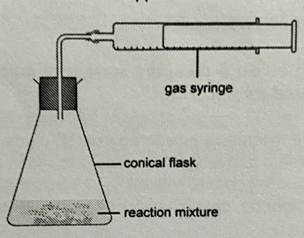

# 📜 Practical planning

## General format

* Method/ Approach (embed in the procedure)
  * Describe how the data/ results can be obtained and how your readings are taken
* Constant variables and variables to be changes (embed in the procedure
* Apparatus and chemicals
  * State the specific quantity and concentration, and what chemicals are in excess
  * e.g. 20cm³ of 1 mol/dm³ of $$HCl$$, 2g of $$CuCO_3$$​, excess magnesium
* Procedure
  * Describe step-by step instructions, and include diagrams of the set-up if necessary
* Results
  * Explain how data collected are process
  * Must link back to the aim

## Speed of reaction (collection of gas)

<figure><figcaption></figcaption></figure>

1. Set up the apparatus as shown and add 50cm³ of 1 mol/dm³ of aqueous hydrogen peroxide in the conical flask and stopper it
2. Measure and record the volume of oxygen gas produced in 60s
3. Repeat the experiment using 50cm³ of 1 mol/dm³ aqueous hydrogen peroxide and 1g of X as the catalyst. Measure and record the volume of oxygen gas produced in 60s
4. The experiment with the catalyst should produce a larger volume of gas in 60s
5. Filter the remaining mixture and dry the X used between filter papers. Weigh the mass of X to check its mass
6. The mass of X powder should be 1g as it so not consumed in the reaction

## Speed of reaction (temperature)

1. Using a measuring cylinder, transfer 20cm³ of ammonium peroxodisulfate into a boiling tube. Measure the temperature of the ammonium peroxodisulfate with a thermometer and record this value in a table
2. Using another measuring cylinder, transfer 20cm³ of 1 mol/dm³ aqueous iodide ions and add it into the boiling tube containing 20cm³ of 1 mol/dm³ ammonium peroxodisulfate and add a few drops of starch solution and start timing immediately. Record the time taken for a blue-black solution to form
3. Wash the boiling tube and place another 20cm³ of 1 mol/dm³ ammonium peroxodisulfate in it. Place the boiling tube in a beaker of water, and heat the beaker with a bunsen burner
4. When the temperature of the ammonium peroxodisulfate reaches 80°C, remove the boiling tube from the beaker. Wait half a minute, measure the temperature and record this value. Then add 20cm³ of 1 mol/dm³ aqueous iodide ions and a few drops of starch solution. Record the time taken for a blue-black solution to form
5. Repeat steps 3-4 but heat the ammonium peroxodisulfate to about 70°C before removing the boiling tube form the beaker. Record the time taken for a blue-black solution to form
6. Repeat septs 3-4 by heating the boiling tube containing ammonium peroxodisulfate to 3 other temperatures. It is not necessary to heat the ammonium peroxodisulfate to these exact temperature, but the correct temperature must be measured half a minute after the tube is removed from the water. Record your values in the table below

| Temperatrure of ammonium peroxodisulfate/ °C | Time taken for blue-black solution to form/ s |
| -------------------------------------------- | --------------------------------------------- |
| 80.0                                         |                                               |
| 70.0                                         |                                               |
| 60.0                                         |                                               |
| 50.0                                         |                                               |
| 30.0                                         |                                               |

From the table, refer to the data obtained to determine if an increases in temperature of ammonium peroxodisulfate by 10°C will cause the time taken for the blue-black solution to be halved

## Acids (Gas collection)

<figure><figcaption></figcaption></figure>

1. Set up the apparatus as shown
2. Measure 25.0cm³ of hydrochloric acid using a pipette/ measuring cylinder and transfer it into a conical flask
3. Add sodium carbonate in excess to the conical flask and stopper it quickly
4. Measure and record the volume of the carbon dioxide gas using the formula: $$number \char32 of \char32 moles = \frac{volume \char32 of \char32 gas}{24000cm^3}$$
5. Using the mole ratio of the number of moles of $$HCl$$​ to $$CO_2$$​ (2:1), calculate the number of moles of hydrochloric acid using the formula:$$number \char32 of \char32 moles \char32 of \char32 HCl = number \char32 of \char32 moles \char32 of \char32 CO_2  \times 2$$&#x20;
6. Hence calculate the concentration of the hydrochloric acid using the formula: $$\frac {number \char32 of \char32 moles \char32 of \char32 HCl}{25  \div  1000}$$

## QA (mole concept)

1. Using a pipette/ measuring cylinder, measure out 25.0cm³ of the aqueous solution containing $$Cl^-$$ ions
2. Add an excess of aqueous silver nitrate to the solution
3. Filter and collect the residue of silver chloride ($$AgCl$$)
4. Wash the residue with a little cold distilled water
5. Dry the silver chloride between pieces of filter papers
6. Weigh the dried silver chloride
7. Calculate the number of moles of silver chloride using the formula: $$number \char32 of \char32 moles \char32 of \char32 AgCl = \frac{mass \char32 of \char32 AgCl}{Mr \char32 of \char32 AgCl}$$
8. Using the mole ratio, the number of moles of chloride ions to silver chloride (1:1) based on the equation $$Ag^+(aq) + Cl^- (aq) \rightarrow AgCl(s)$$​
9. Calculate the concentration of chloride ions present in the solution in mol/ dm³ using the formula $$concentration = \frac{number \char32 of \char32 moles}{volume \char32 of \char32 chloride \char32 solution}$$

## Metals (decomposition of metal carbonate)

<figure><figcaption></figcaption></figure>

1. Set up the apparatus as shown in the diagram above
2. Using an electronic balance, weigh 1g of powdered $$MgCO_3$$​and transfer it into a dry boiling tube
3. Stopper the boiling tube with the rubber bung attached to a graduated gas syringe
4. Heat the metal carbonate strongly and start the stopwatch immediately
5. Record the time taken for 30cm³ of carbon dioxide gas to be collected in the gas syringe/ record the volume of gas collected in 30s
6. Repeat the experiment to obtain an average&#x20;
7. Repeat steps 2-6 with powdered copper (II) carbonate and zinc carbonate
8. The shorter the time taken for 30cm³ of carbon dioxide gas to be collected, the less stable the metal carbonate is to heat, the less reactive the metal/ the greater the volume of carbon dioxide gas collected in 30s, the less reactive the metal

## Redox (Titration)

1. Fill the burette with $$KMnO_4 (aq)$$
2. Pipette 25.0 cm³ of $$H_2O_2 (aq)$$ into a conical flask, add in a test-tube full of $$H_2SO_4$$​, and tritate it with $$KMnO_4 (aq)$$
3. Titrate until one drop of $$KMnO_4$$​ causes the solution to produce a permanent pink colour
4. Record the initial and final burette readings and calculate the volume of $$KMnO_4 (aq)$$ required in cm³($$final \char32 - initial \char32 burette \char32 reading$$)
5. Repeat the titration until consistent results are achieved
6. Calculate the concentration of potassium manganate (VII) using the formula:\
   Mole ratio: $$2KMnO_4 = 5 H_2O_2$$​\
   $$\frac{conc \char32 of \char32 KMNO_4 \times Volume \char32 of KMnO_4 \char32 obtained \char32 in \char32 step \char32 4}{Known \char32 conc \char32 of \char32 H_2O_2 \times 25cm^3}= \frac{2}{5}$$\
   $$conc \char32 of \char32 KMNO_4 = \frac{2 \times Known \char32 conc \char32 of \char32 H_2O_2 \times 25cm^3}{5 \times Volume \char32 of KMnO_4 \char32 obtained \char32 in \char32 step \char32 4}$$


For any titration planning question, DO NOT USE UNIVERSAL INDICATOR

This is because it is hard to determine the end-point

Use screened methyl orange/ thymol blue


## Metals (Separation techniques)

1. Add excess dilute nitric/ sulfuric acid/ hydrochloric acid to the mixture in a beaker
2. Stir using a glass rod/ heat the mixture over a bunsen burner until no more acid can dissolve
3. Filter the resulting mixture using a filter funnel with filter paper and a conical flask
4. The residue is a black solid (carbon) and the filtrate is a green solution (Iron (II) nitrate/ sulfate/ chloride solution)
5. Wash the black solid (carbon) using deionized/ distilled water
6. Dry the black solid (carbon) between pieces of filter paper

## Acids (Separation techniques)

1. Weigh 1g of mixture using an electronic balance
2. Add excess warm sulfuric acid to the mixture and stir
3. Filter the mixture, was the carbon residue and dry it
4. Reweigh the mixture and calculate the percentage by using the formula: $$\frac{1g - mass \char32 of \char32 C}{1g} \times 100 \%$$

## Mass of a water in a hydrated salt (carbonate)

### Method 1

1. Add a known mass of the sample to an excess of nitric acid. Collect and measure the volume of carbon dioxide produced
2. Using molar volume of gas, calculate the number of moles of gas. Hence the number of moles of ​$$K_2CO_3$$​ can be found
3. Mass of $$K_2CO_3$$​ can be found
4. Subtract mass of $$K_2CO_3$$​ from the known mass of the sample, divide the mass of water by the known mass of sample S to find the percentage by mass

### Method 2

1. Heat the known mass of S until there is no change in mass (Only can do on group I salts as they are very thermally stable and do not decompose on heating)
2. Find the mass of $$K_2CO_3$$​
3. Subtract the mass of $$K_2CO_3$$​ from the known mass of the sample, divide the mass of water by the known mass of sample S to find the percentage by mass

## Empirical formula of Iron oxide

1. Weigh the 20cm iron oxide using an electronic balance. Record as the initial mass
2. Place the oxide in a crucible
3. Strongly heat the oxide for 2 minutes
4. Weigh the oxide and record its mass
5. Continue to heat the oxide and weigh unless its mass becomes constant
6. Record the final mass, which is the mass of iron oxide
7. The mass gained indicates the mass of oxygen gained to form the oxide
8. Find the empirical formula of iron oxide by fining the simplest mole ratio of the iron and oxygen

## Endothermic reactions

1. Measure 30cm³ of distilled water and place it in a styrofoam cup nested on a beaker
2. Measure the initial temperature of the water
3. Weigh out 5g of salt X with an electronic balance
4. Add the 5g of salt X to the water and measure the lowest temperature react
5. Repeat the procedure with salt Y and Z
6. Find the temperature drop by taking the difference between the final and initial temperature
7. The salt which gave the largest drop in temperature is the one which produces the greatest endothermic change when dissolved in water

