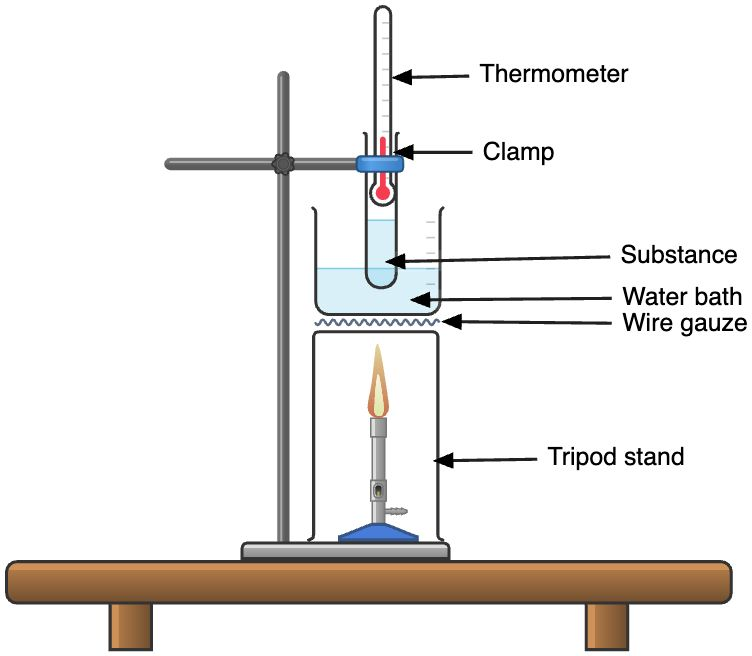

# 🧪 Separation and purification

## Checking for purity

* Pure substances contain only one type of substance (one element or compound)

### Melting point

* All of the pure substance melts at the same fixed and constant temperature
* Impure substances melt over a range of temperatures, and melting starts at lower temperatures than when the substance is pure

#### Set-up to test for the melting point of a substance

<figure><figcaption></figcaption></figure>

1. Put a small amount of solid into the boiling tube
2. Place thermometer into the solid
3. Place the boiling tube in a beaker containing water
4. Heat the water bath with the bunsen burner until the solid starts to melt
5. Measure and record the temperature when the solid melts

### Boiling point

* All of the pure substance boils at a fixed and constant temperature
* Impure substances will boil over a range of temperatures and boiling starts at a higher temperature than when the substance is pure

#### Set-up to measure boiling point

<figure><figcaption></figcaption></figure>

1. Fill half a beaker with water to be sued as a hot water bath
2. Fill 1/3 of a clean and dry boiling tube with the liquid
3. Clamp the boiling tube to the retort stand, and adjust its position such that the bulb of the thermometer is just above the ethanol level in the boiling tube
4. Immerse the boiling tube in the water bath
5. Clamp a thermometer to the retort stand. adjust its position above the ethanol level in the boiling tube
6. Heat the water bath with the bunsen burner until the ethanol starts to boil
7. Measure and record the boiling point of ethanol

### Paper chromatography

* Pure substances will produce a single spot on the chromatogram
* Impure substances will produce two or more spots on the chromatogram

<figure><figcaption></figcaption></figure>

* The solutes have different solubility in the same solvent
* Solutes with higher solubility in the solvent will travel a further distance and get seperated from solute with a lower solubility in the same solvent
* Used for dyes present in food/ ink mixture/ amino acids in proteins
* Locating agent is a substance that is sprayed onto the chromatogram to react with the colourless spots and make it visible
* The starting line is to be drawn is pencil as pencil contains graphite and does not dissolve in most solvents, and it does not interfere with the spots
* Small spot to prevent interference with other spots and become unclear
* The starting line is to be above the solvent level to prevent the sample from dissolving in the solvent and not be separated out
* Lid to cover the set-up to prevent the solvent from evaporating away and preventing chromatography from taking place
* Solvent front to be near the top of the paper/ furthest away from the starting line to ensure that the solvent has travelled sufficient distance and the sample is separated

#### Rf values

* Each analyte has a particular $$R_f$$​values, retention factor, with each solvent and by comparing the experimental values with the known values of $$R_f$$, the analyte can be identified
* $$R_f$$​ is to be written in decimal place
* A good resolution for the chromatogram is obtained when the $$R_f$$​ values is about 0.500  to 0.8000
* Formula: $$\frac{Distance \char32 moved \char32 by \char32 analyte (D_A)}{Distance \char32 moved \char32 by \char32 solvent (D_S)}$$

​

<figure><figcaption></figcaption></figure>

* The same substance will have the same $$R_f$$​value in the same solvent and same temperature despite different distance travelled by the solvent front

#### Descending chromatography

* Increase in the resolution of chromatogram as the sample travels over a longer distance due to the pull of gravity
* But, a longer piece of paper is needed for the chromatogram

## Separating Solid-solid mixtures

### Magnetic separation

* One of the solids has a magnetic property (cobalt, nickel, iron)
* The solid that has a magnetic property will be attracted to a magne while the other solid is left behind

1. Hold the magnet above the mixture and sweep it across till all the iron is attracted to hte magnet
2. The solid that does not have a magnetic property will be left beind

### Sublimation

* One of the solids can sublime on heating (ammonium salts, iodine crystals, solid carbon dioxide, naphthalene)

<figure><figcaption></figcaption></figure>

* The solid that can sublime will vaporize and condense on the cool surface of the filter funnel while the other solid will be left behind in the evaporating dish

1. Place the mixture in an evaporating dish
2. Hold an inverted filter funnel over the mixture in the evaporating dish
3. Heat the mixture
4. The solid that can sublime will vaporize and condense on a cool surface, while the other solid will be left behind in the evaporating dish

### Dissolution and filtration

* One of the solids is soluble in a solvent while the other is insoluble
* Evaporation can be used to obtain the salt solid form the salt solution filtrate

<figure><figcaption></figcaption></figure>

* The particles of insoluble solid are too big to pass through filter paper, thus left behind as residue, while the particles of soluble solid are small enough to pass through filter paper as filtrate

1. Add and stir/ Dissolve the mixture in a suitable solvent
2. Filter the mixture
3. Collect the salt solution that pass through the filter paper in a  conical flask as the filtrate
4. Wash the residue with a little cold distilled water to remove any soluble impurities
5. Dry the residue on a piece of filter paper

## Separating Solid-liquid mixtures

### Filtration

* Insoluble solid in a liquid

<figure><figcaption></figcaption></figure>

* The particles of insoluble solid are too big to pass through filter paper, thus left behind as residue, while the particles of soluble solid are small enough to pass through filter paper as filtrate

1. Filter the mixture
2. Collect the liquid that passes through the filter paper in a conical flask as the filtrate
3. Wash the residue with a little cold distilled water to remove any soluble impurities
4. Dry the residue on a piece of filter paper

### Evaporation

* Soluble solid in a liquid to form a homogenous solution

<figure><figcaption></figcaption></figure>

* The solid is stable to heat, remains stable on heating and does not decompose (group I salts)
* Heat the solution till dryness

### Crystallisation

* Soluble solid in a liquid to form a homogenous solution

<figure><figcaption></figcaption></figure>

* If evaporated to dryness, the solid will decompose on heating (sugar, most soluble salts other than group I salts)

1. Heat the solution till its point of saturation
2. Cool the solution to allow crystals of copper (II) sulfate to appear
3. Filter to obtain the crystals
4. Wash the crystals with a little cold distilled water to remove any soluble impurities
5. Dry in between sheets of filter paper

* A saturated solution is a solution that contains the maximum amount of solute at a given temperature
* Dip a glass rod into the solution and wait for crystals to form as it cools to test for saturation

### Simple distillation

* Soluble solid in a liquid to fomra  homogenous solution

<figure><figcaption></figcaption></figure>

* Liquid of a lower boiling point will distill over first, while solid of a very high boiling point will be left behind in the distilling flask
* The boiling chips are to ensure smooth boiling
* The thermometer is to measure the temperature of the boiling point of the solvent that is being distilled over
* The condenser is to ensure full circulation of water to cool the condenser efficiently

## Separating Liquid-liquid mixtures

### Separating funnel

* Both liquids are immiscible

<figure><figcaption></figcaption></figure>

* Liquid with a higher density will sink to the bottom of the separating funnel and will be removed first
* Liquid of a lower density will be left in the separating funnel and removed later

1. Mixture is placed into a separating funnel
2. Leave the mixture until the liquids separate into 2 distinct layers
3. Denser liquid is found on the bottom of the funnel
4. Denser liquid is removed from the bottom of the funnel into a receiving beaker or conical flask

### Fractional distillation

* Both liquids are miscible

<figure><figcaption></figcaption></figure>

* Liquid of a lower boiling point will distill over first
* Liquid of a higher boiling point will condense and fall back into the distilling flask
* Liquids have a boiling point close to one another
* Boiling chips to ensure smooth boiling
* Thermometer to measure the boiling point of the liquid that is being distilled over
* Condenser to ensure full circulation of water to cool the condenser efficiently
* The glass beads in the fractionating column will prove a large surface area for cooling of the vapour
