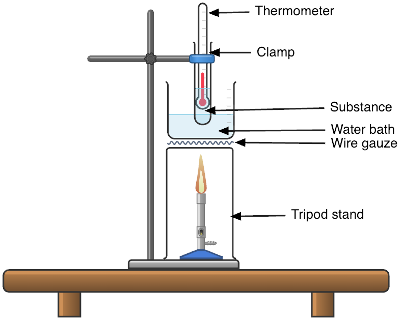
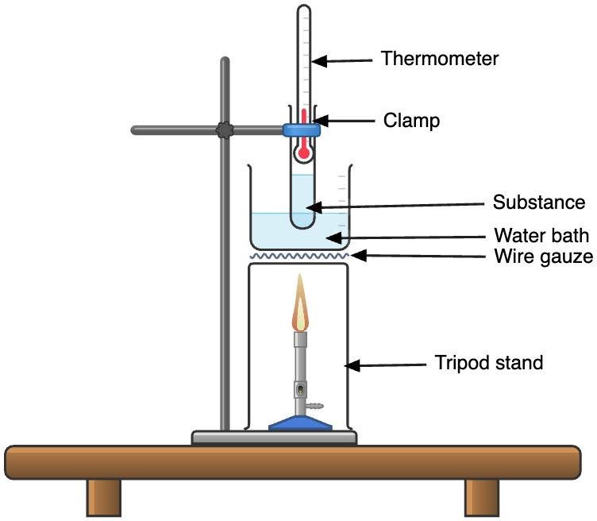

# 🧪 Separation techniques

## Purity

* Pure substances contain only one type of substance

### Importance

* Manufacturing of drugs for safe consumption
* Manufacturing of semi-conducting devices (diodes and transitions) where silicon and geranium must be of exceptional purity
* Manufacturing food additives where it is used in small quantities and conform to an approved standard of purity

### Checking for purity

#### Finding the melting point of solid

* Pure substances will melt at the same fixed and constant temperature
* Impure substances melt over a range of temperature, and melting will be at a lower temperature than if the substance was pure

1. Put a small amount of solid into the boiling tube
2. Put the thermometer into the solid
3. Place the boiling tube in a beaker containing water
4. Heat the water bath with the bunsen burner untill the solid starts to melt
5. Measure and record the temperature when the solid melts

#### Finding the boiling point of a liquid

* Pure substances boil at the same fixed and constant temperature
* Impure substance will boil over a range of temperatures, and boiling will be at a higher temperature than when the substance is pure

​

1. Fill half a beaker with water to be used as a hot water bath
2. Fill 1/3 of a clean and dry boiling tube with the substance
3. Clamp the boiling tube to a retort stand
4. Immerse the boiling tube in the water bath
5. Clamp a thermometer to the retort stand and adjust the position such that the bulb of the thermometer is just above the substance level in the boiling tube
6. Heat the water bath with the bunsen burner until the water starts to boil
7. Measure and record the boiling point of the substance

* A water bath is used to ensure even heating, and that the substance does not decompose under strong heating

#### Paper chromatography

* Paper chromatography is a technique of separating and identifying components of a mixture as it is carried by a solvent or gas over the surface of material
* Pure substances will produce a single spot on the chromatogram
* Impure substances will produce two or more spots on the chromatogram
* The solutes have different solubility in the same solvent
  * **Solutes with higher solubility will travel a further distance and get separated form solute with a lower solubility in the same solvent**
* A locating agent is a substance that is used to spray onto the chromatogram to react with the colorless spots and make it visible

.png>)

1. The starting line has to be draw in pencil
   * Pencil contains graphite and does not dissolve in most solvents and it does not interfere with the spots
2. Small spots
   * This is to prevent inference with other spots and become unclear
3. Starting line to be above solvent level
   * To prevent the sample from dissolving in the solvent and not be separated out
4. Lid to cover the set up
   * To prevent the solvent from evaporating away and prevent chromatography from taking place
5. Solvent front to be near the top of the paper/ furthest away from the starting line
   * To ensure that the solvent has traveled sufficient distance and the sample is separated

#### $$R_f$$​ value

* Each solute has a particular $$R_f$$​value, or retention factor with each analyte
* By comparing the experimental values with known values of $$R_f$$​, the analyte can be identified
* Written in decimal place
* Formula: $$\frac{D_a}{D_s}$$​, where $$D_a$$​is the distance moved by analyte and $$D_s$$​is the distance moved by the solvent
* The same substance will have the $$R_f$$​value in the same solvent and same temperature despite different distance travelled by solvent front

#### Descending chromatography

* Increase in resolution of chromatogram as sample travels over a longer distance due to the pull of gravity
* But a longer piece of paper is needed for the chromatogram

## Separating solid-solid mixtures

### Magnetic separation

* One of the substances has a magnetic property (cobalt, nickel, iron)
* The solid that has a magnetic property will be attracted to a magnet while the other solid is left behind

1. Hold the magnet above the mixture and sweep it across till all the iron is attracted to the magnet
2. Sulfur will be left in the perti dish

### Sublimation

* One of the solids can sublime on heating (ammonium salts, iodine crystals, solid carbon dioxide, naphthalene)
* The solid that can sublime will vaporize and condense on the cool surface of the filter funnel, while the other solid will be left behind in the evaporating dish

.png>)

1. Place the mixture in an evaporating dish
2. Hold an inverted filter funnel over the mixture in the evaporating dish
3. Heat the mixture
4. The solid that can sublime will vaporize and condense on a cool surface, while the other solid will be left behind in the evaporating dish

### Dissolution and filtration

* One of the solids is soluble in a solvent while the other is insoluble
* Evaporation can be used to obtain the salt solid from the salt solution filtrate
* The particles of the insoluble solid are too big to pass through filter paper, thus it is left behind as residue while the particles of the soluble solid are small enough to pass through filter paper as filtrate

1. Add and stir/ dissolve the mixture in a suitable solvent
2. Filter the mixture
3. Collect the salt solution that passes through the filter paper in a conical flask as the filtrate
4. Wash the sand residue with a little cold distilled water to remove any soluble impurities
5. Dry the residue on a piece of filter paper

## Solid-liquid mixture

### Filtration

* The solid particles of the insoluble solid are too big to pass through filter paper, thus it is left behind as residue while the particles of the smaller solid are small enough to pass through the filter paper as filtrate

1. Filter the mixture
2. Collect the water that pass through the filter paper in a conical flask as the filtrate
3. Wash the chalk residue with a little cold distilled water to remove any soluble impurities
4. Dry the residue on a piece of filter paper

### Evaporation

* The solid is stable to heat, remains stable on heating and do not decompose (e.g group I salts)

.png>)

1. Heat the solution till dryness

### Crystallization

* If evaporated to dryness, the solid will decompose on heating (sugar, most soluble salts other than group I salts)
* A saturates solution is a solution that contains the maximum amount of solute at a given temperature

1. Heat the solution till its point of saturation
2. Cool the solution totally crystals the salt to appear
3. Filter to obtain the crystals
4. Wash the crystals with a little cold distilled water
5. Dry in between sheets of filter paper

### Simple distillation

* Liquid of a lower boiling point will distill over first, while solid of a very high boiling point will be left behind in the distilling flask
* Boiling chops are to ensure smooth boiling
* The thermometer is to measure the boiling point of the solvent that is being distilled over
* The condenser has water going in at the bottom and coming out at the top to ensure full circulation of water to cool the condenser efficiently

.png>)

1. During distillation, the liquid mixture is heated till it boils, and the porcelain chips are placed in the liquid to ensure smooth boiling
2. The liquid boils and becomes vapor. The thermometer measures the temperature of the vapor
3. The vapor is then cooled in the condenser which has cold waster passing though it continuously

## Liquid-Liquid mixtures

### Separating funnel

* Liquid with a higher density will sink to the bottom of the separating funnel and be removed first, while liquid of a lower density will be left in the separating funnel and removed later

1. The mixture is placed into a separating funnel
2. Leave the mixture till the liquids separate into 2 distinct layers
3. Denser liquid is found on the bottom of the funnel, and is removed into a receiving beaker or conical flask

### Fractional distillation

* Liquid of a lower boiling point will distill over first, while liquid of a higher boiling point will condense and fall back into the distilling flask

.png>)

* Boiling chips are to ensure smooth boiling
* The thermometer is to measure the boiling point of the liquid that is being distilled over
* The condenser has water going in at the bottom and coming out at the top to ensure full circulation of water to cool the condenser efficiently
* The glass beads in the fractional column proivdes a large surface area for cooling of the vapour
