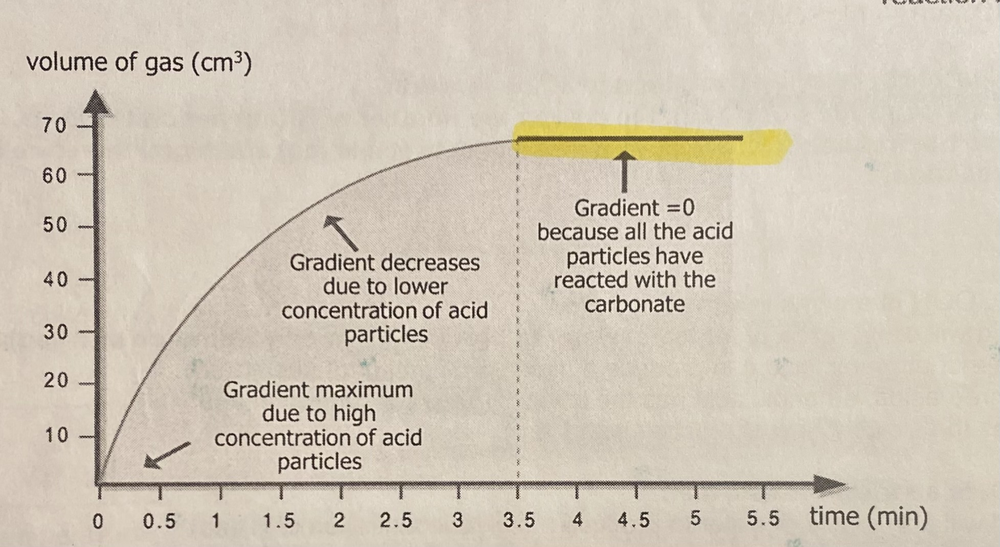

# 📈 Speed of reaction

* Speed of reaction = $$\frac {amount \char32 of\char32 reactant \char32 used \char32 up}{time\char32 taken}$$= $$\frac {amount \char32 of \char32 product \char32 formed}{time\char32 taken}$$
* The speed of reaction decreases over time, as the concentration of the reagents decreases with time

## Why though?

* By manufacturing the chemical in a shorter space of time, the company will
  * Meet the needs of its customers, especially if the chemical is high in demand
  * Ensure that all equipment is used to its full capacity
  * Increase profit margins/ make more money
* But, some reactions are very exothermic, and it may be necessary to slow down these reactions to reduce the energy that is released, and reduce the chance of an industrial accident

## The collision theory of particles

* Particles do not always react when the collide, and may just bounce apart
* To react, the particles must have enough energy equal to or greater than the activation energy for the reaction, in order for the collision to be effective

### Concentration

* As the concentration increases, the number of particles (limiting reagent) per unit volume increases
* This increases the frequency of effective collisions between particles
* The higher the concentration, the higher the speed of reaction

### Temperature

* As the temperature increases, the kinetic energy of the particles increases and the particles move faster
* This increases the frequency of effective collisions between particles
* The higher the temperature, the higher the speed of reaction

### Particle size

* The smaller the size of the particles, the greater the surface area per unit mass
* This increases the frequency of effective collision between particles
* The smaller the size of the particles, the higher the speed of reaction

### Catalysts

* Catalysts provide an alternative route with lower activation energy for reactions to occur
* More reactants particles will have energy equal or greater than the activation energy

OR

* More particles are able to collide with enough energy for reaction to occur
* This increases the frequency of effective collision between particles
* Catalysts increase the speed of reaction

### Pressure (of a gas)

* The higher the pressure, the greater the number of reactant particles per unit volume
* This increases the frequency of effective collision between particles
* The higher the pressure, the higher the speed of reaction

### Chemical property of the reactants

_i need to find my prelim shit to type in here argh_

## Measuring and determining the rate of a chemical reaction

* Change in temperature
* Formation of a precipitate (for reactions that result in the formation of an insoluble product)
  * Place an X below the conical flask where the reaction is held and find the time taken for the X to disappear
* Change in colour
* Change in pH value
* Change in volume (For gasses)
* Change in Mass

## Reaction graphs

<figure><figcaption></figcaption></figure>

### Initial gradient

* If a variable has been changed that will increase the rate of reaction, the initial gradient should be steeper
* If a variable has been changed that will decrease the rate of reaction, the initial gradient should be gentler

### Reaction stop

* The point at which  the reaction is complete is indicated by the point at which the variable being measured  against time becomes constant
* If a variable has been changed that will increase the rate of reaction, the reaction will take a shorter time to finish
* If a variable has been changed that will decrease the rate of reaction, the reaction will take a longer time to finish

### How much product is formed?

* Increasing the concentration of the solution in reactions where the solution is the limiting reagent will increase the rate of reaction and the amount of product formed
* Increasing the volume of the solution in reactions where the solution is the limiting reagent will increase the amount of product formed

