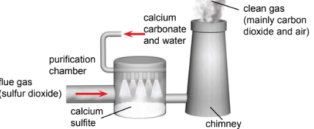

# 🏭 The atmosphere and the environment

## Air pollution

* Air pollution is a condition in which air contain a high concentration of chemicals that may ahrm living things and damage non-living things
* Air pollution is caused by solid particles (Fine particles such as soot (carbon)) and harmful gases in the air (Main pollutants:$$CO, SO_2, NO_2$$, unburnt hydrocarbons: $$CH_4,$$​ozone)

### Sulfur dioxide

* Mainly from the combustion of fossil fuels which contain sulfur impurities (e.g. cal) in power stations and factories
* $$S(s) +O_2(g) \rightarrow SO_2(g)$$​
* Other sources include volcanic eruptions
* Combustion of fuels such as petrol and diesel in car engines

#### Harmful effects

* Can cause breathing difficulties
* Irritates eyes and lungs
* Reacts with oxygen and rain water to form acid rain which corrodes marble buildings

#### Testing

* It is a colourless gas with a pungent smell
* It is a reducing agent
* Can be tested using a piece of filter paper soaked with acidified potassium manganate(VII) ($$KMnO_4$$) at the mouth of the test tube
* The purple acidified potassium manganate turns colourless

#### Flue gas desulfurization

* To minimise the effects of sulfur dioxide pollution, the sulfur can be removed from fossil fuels before burning, but this method is too expensive and difficult
* Flue gas desulfurization is the use of the neutralisation reaction to remove sulfur dioxide from the waste gases formed when the fossil fuels undergo combustion
* It is cheaper
* The waste gases are called flue gases
* The process of removing sulfur dioxide form flue gases is called desulfurization
* Since sulfur dioxide is an acidic gas, it can be neutralized when it reacts with solid calcium carbonate or react with a base like calcium oxide to form neutral calcium sulfite
* $$2CaCO_3(s) _ SO_2(g) \rightarrow CaSO_3(s) + CO_(g)$$
* $$2CaSO_3(s) + O_2(g) \rightarrow 2CaSO_4(s)$$​

<figure><figcaption></figcaption></figure>

### Carbon monoxide

* Mainly from the incomplete combustion of carbon containing fuels in power plants, factories or combustion engines of vehicles due to insufficient oxygen

#### Harmful effects

* Causes respiratory difficulties (cannot write breathing difficulties)
* Toxic/ poisonous

### Nitrogen oxides

* Mainly from nitrogen combining with oxygen at high temperature in the car engines
* Lighting activity
* At high temperatures, nitrogen combines with oxygen to form nitrogen monoxide ($$NO$$)
* $$N_2(g) +O_2 (g) \rightarrow 2NO(g)$$
* $$NO$$​ reacts with oxygen to produce nitrogen dioxide ($$NO_2$$​)
* $$2NO(g) +O_2(g) \rightarrow 2NO_2(g)$$

#### Harmful effects

* Cause breathing difficulties
* Irritate the eyes and lungs
* React with oxygen and rainwater to form acid rain which corrodes marble buildings

### Other air pollutants

* Methane is produced when plant and animal matter decay, and when rubbish in landfills decay
* Unburnt hydrocarbons are released in car exhaust and chemical plants

### Ozone

#### Ground level

* Formed in a photochemical reaction when nitrogen dioxide in the air reacts with unburnt hydrocarbons in sunlight
* Formed in a photochemical reaction between oxygen and UV radiation form the sun
* Is a pollutant at ground level
* Non-toxic in small concentrations, but toxic in concentration above 100 parts per million

#### Ozone layer

* Is a pale blue gas found in the upper layer of the earth called the stratosphere (20-50 km above sea level)
* Acts as a shield to filter out harmful ultraviolet radiation from the sun to protect man from the harmful effects of too much UV radiation such as skin cancer, eye damage and genetic mutation
* Can cause serious damage to plants and discomfort to the nose, throat and chest

#### Depletion of the ozone layer

* THe ozone layer is depleting in recent years due to chlorofluorocarbons (CFCs)
* CFCs contain carbon, fluorine and chlorine
* Were widely used as propellants for aerosols and as coolants in refrigerators and air conditioners, and the manufacture of packing foam
* Fluorine gives stability to CFCs, making them persistent in the atmosphere (difficult to remove)
* Decompose into chlorine atoms in the presence of UV light
* The atoms react with ozone molecules, making chlorine monoxide ($$Cl_2O$$​), destroying the ozone layer

## Acid rain

* Acid rain
  * Acidifies lakes and streams -> aquatic plants and animals dies
  * Leaches nutrients from soil, reacts with $$Al(OH)_3$$in soil to produce toxic $$Al^{3+}$$ -> Plants wither and die
  * Reacts with metals and carbonates -> Marble and limestone buildings / statues corrode; metal bridges are damaged​
* The acid in acidified lakes and rivers can be neutralised through a process called liming
* The chemical used to neutralise the acid is powdered limestone ($$CaCO_3$$​), but it is expensive for farmers and the effects are only temporary

## Catalytic converters

* Motor cars are fitted with catalytic converters to remove air pollutants in vehicle exhaust gases
* When the hot exhaust gases pass over the platinum and rhodium catalysts, the harmful pollutants undergo redox reactions are converted into harmless substances
* Carbon monoxide (RA) is oxidised to carbon dioxide while nitric oxide (OA) is reduced to nitrogen
* $$2CO(g) + 2NO(g) \rightarrow N_2(g) + 2CO_2(g)$$​
* Unburnt hydrocarbons are oxidised to carbon dioxide and water
* $$2C_8H_{18} (l)+ 25O_2(g) \rightarrow 16CO_2 (g)+ 18H_2O (g)$$
* The redox reactions that takes place removes the pollutants
  * Toxic carbon monoxide is oxidised to non-toxic greenhouse gas carbon dioxide
  * Harmful oxides of nitrogen which cause acid rain, etc, are reduced to harmless nitrogen
* Other methods to reduce air pollution caused by motor vehicles include
  * Using lightweight alloys to make car bodies to improve fuel efficiency
  * Switching to electric or hybrid electric vehicles to reduce exhaust gas emissions
  * Use alternative fuels such as hydrogen fuel, where products of combustion are harmless

## The carbon cycle

* The carbon cycle is the mechanism that maintains the level of carbon dioxide in the atmosphere
* For the atmosphere to maintain a constant amount of carbon dioxide, Rate of removal of $$CO_2$$​ = Rate of return of $$CO_2$$​
* Return of $$CO_2$$​
  * During respiration, glucose in food we eat is converted into carbon dioxide and water, and energy is also released ($$C_6H_{12}O_6 (aq) + 6O_2 (g) \rightarrow 6CO_2 (g) + 6H_2O (l) + energy$$)​
  * The burning of fuels like methane releases carbon dioxide ($$CH_4(g) + 2O_2(g) \rightarrow CO_2(g) +2H_2O(g) + energy$$​)
  * Decay and bacterial decomposition
* Removal of$$CO_2$$​
  * During photosynthesis, green plants convert carbon dioxide and water into glucose and oxygen in the presence of sunlight
  * $$6CO_2 (g) + 6H_2O(l) \rightarrow _{sunlight, chlorophyll} C_6H_{12}O_6(aq) + 6O_2 (g)$$
  * Ocean uptake

### The greenhouse effect

* Greenhouse gases carbon monoxide and methane trap/ absorb the heat energy radiated back from the surface of the earth to prevent heat from escaping into the atmosphere
* Carbon dioxide is from the combustion of fossil fuels
* Methane is from the bacterial decay of vegetation

#### Global warming

* Activities like the burning of fossil fuels and the large-scale cutting down of forests are causing some greenhouse gases, especially carbon dioxide to build up rapidly in the atmosphere
* This means that carbon dioxide is being added to the atmosphere at a higher rate than photosynthesis can remove the excess gas
* The effect of carbon dioxide build-up leading to an increase in the earth's average temperature is known as global warming

#### Effects

* Melting of large quantities of ice caps in the North Pole and South Pole, which results in sea level rise, leading to floods in low-lying regions
* Decrease in crop yields worldwide as areas covered by vegetation may be deserts
* Rapid evaporation of water form the earth's surface, resulting in the release of dissolved carbon dioxide in oceans, adding to further greenhouse effect
