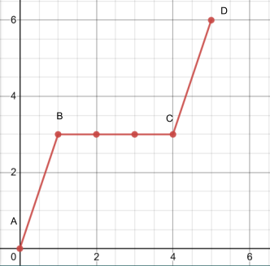

# 💡 Light

## Reflection of light

* The normal is perpendicular to the reflecting surface
* The angle of incidence is the angle between the normal and incident ray
* The angle of reflection is the angle between the reflected ray and the normal
* The first law of reflection that the incident ray, reflected ray and the normal at the point of incidence all lie in the same plane
* The second law of reflection states that the angle of incidence is equal to the angle of reflection
* Images formed by a plane mirror is upright, laterally inverted, same size as the object, virtual and the distance from the image in the mirror is equal to the distance of the object from the mirror

## Refraction of light

* Refraction is the bending of light as it passes from one medium to another as the speed of light changes as it travels from one medium to another
* The normal is perpendicular to the refracting surface
* The angle of incidence is the angle between the normal and the incident ray
* The angle of refraction is the angle between the refracted ray and the normal
* The first law of refraction states that the incident ray, refracted ray and the normal all lie in the same plane
* The second law or refraction states that for 2 given mediums, the ratio of the sine of the angle of incidence ot the sine of angle on incidence is a constant
* This is also known as snell's law
* The refractive index of a medium is defined as the ratio of the speed of light in a vacuum to the speed of light in a medium
* Formula: $$n = \frac{c}{v} = \frac {\sin i }{\sin r}$$, where c = speed of light  light in a vacuum ($$3 \times 10^8$$ m/s), v = speed of light in the medium (m/s), i = angle of incidence, r = angle of refraction
* $$\frac {\sin i }{\sin r}$$ can only be applied for air into a denser medium only
* When light passes from an optically less dense medium (lower refractive index) to an optically denser medium (higher refractive index), it will be towards the normal because light travels slower in the optically denser medium
* When light passes from an optically denser medium (higher refractive index), to an optically less dense medium (lower refractive index), it will bend away from the normal because light travels faster in the optically less dense medium

## Total internal reflection

* The critical angle is the angle of incidence in an optically denser medium for which the angle of refraction in the optically less dense medium is 90°
* When light travels from an optically denser medium to an optically less dense medium, the maximum angle of refraction is 90°, when this happens, the angle of incidence is the critical angle
* Formula: $$n = \frac{1}{\sin c}$$, where n = refractive index, c = critical angle
* If we increase the angle of incidence beyond the critical angle, there is not more refraction and instead, all the light will be reflected back into the medium of the incident ray, which is known as total internal reflection
* Total internal reflection occurs when light travels from an optically denser medium to an optically less dense medium, and the angle of incidence in the optically denser medium is greater than the critical angle
* Used in prisms in periscopes and binoculars
* An optical fibre is a core of higher refractive index, coated with a material with a lower reflective index
* Even when the cable is bent, light will be internally reflected at the boundary between the materials
  * Can carry more information over longer distance than copper wires
  * Experience less signal loss as compared to copper wires
  * Lighter than copper wires
  * Cheaper to manufacture than copper fires

## Refraction by thin lenses

* As the surface of a lens is curved, parallel light rays hitting different parts of the surface have a different angle of incidence, causing the individual rays to refract by different angles
* the angle of incidence is largest at the outermost part of the lens, while no refraction occurs in the middle
* For thin lenses, we assume that bending of light only occurs once at the centre of the lens then twice at curved surfaces
* The principal axis is the horizontal line passing through the optical centre of the lens
  * It is perpendicular to the vertical plane of the lens
* The optical centre is the midpoint between the surfaces to the lens on its principal axis
* The focal length is the distance between the optical centre and the focal point
* Focal point is the point at which all rays parallel to the principal axis converge after refraction by the lens
  * A lens has 2 focal points, one on each side

<figure><figcaption></figcaption></figure>

* Focal plane is the plane that passes through the focal point, and perpendicular to the principal axis
* When the parallel beam or incident rays on a thin converging lens is not parallel to the principal axis, the rays are refracted to a point on the focal plane (directly below or above the focal point)
* A real image has the light rays meeting at the image position so that the image can be captured on a screen
* A virtual image is where the light rays do not meet at the image position, so that the image cannot be captured on a screen

| Object distance                                                         | Properties of image                                                             | Applications                           |
| ----------------------------------------------------------------------- | ------------------------------------------------------------------------------- | -------------------------------------- |
| 
U at infinity 
 | 
Image on the opposite side of the Lens Real Diminished Inverted
 | Objective lens of telescope            |
| U > 2f                                                                  | 
Image on the opposite side of the lens Real Diminished Inverted
 | Camera                                 |
| U = 2f                                                                  | 
Image on the opposite side of the lens Real Same size inverted
  | Photocopier making the same sized copy |
| f < U <2f                                                               | 
Image on the opposite side of the lens Real Magnified  Inverted
 | Projector                              |
| U = f                                                                   | 
Image on the same side of the lens Virtual Same size Upright
    | Eyepiece lens of a telescope           |
| U < FI                                                                  | 
mage on the same side of the lens Virtual Magnified Upright
     | Magnifying glass                       |
