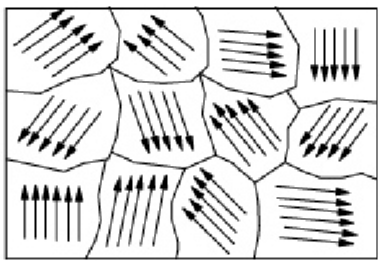
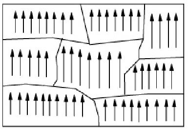

# 🧲 Magnetism

## Magnets and magnetic materials

* Magnets have two poles, the north pole and the south pole
* The magnetic strength is strongest at the poles
* A freely suspended magnet comes to rest in the north-south direction, the north pole of the magnet pointing to the geographic north pole of the earth, hence, they can be used as compasses
* Like poles repel and unlike poles attract
* Materials that are attracted by magnets are called magnetic materials, while those that are not attracted are called non-magnetic materials

| Magnetic materials | Non-Magnetic materials |
| ------------------ | ---------------------- |
| Steel              | Wood                   |
| Iron               | Copper                 |
| Cobalt             | Plastic                |
| Nickel             | Aluminum               |

* Repulsion is the only test to determine whether the object is a magnet or not
* Attraction is not a definite test as a magnetic material which is not a magnet could be attracted to the magnet

## Magnetic induction

* Magnetic induction is the process whereby an **object made of a magnetic material becomes a magnet when it is near or in contact with a magnet**

How does a magnet attract an iron bar?

* The iron bar first becomes an induced magnet due to magnetic induction
* An opposite pole will be induced on the iron by the magnet
* Since unlike poles attract, the iron bar will be attracted to the magnet

Explain why the wood is held between the magnet and the paper clips although it is not a magnetic material

* The paper clips are magnetized by magnetic induction
* This process **does not require physical contact** between the magnet and the magnetic material
* The magnetic material only needs to be near the magnet
* The bottom tips of the paper clips are pointing away as they have become induced magnets, and have the same/ like poles at the bottom tips of the paper clips, and repel each other

## Magnetization and demagnetization

* Magnets are made of atoms
* Each atom is an atomic magnet due to the orbiting motion of electrons around the nucleus of atoms
* A group of magnets pointing in the same direction forms a **magnetic domain**
* During magnetization, the magnetic domains become magnetized in the same direction

* The magnetic domains in an magnetized bar point in random directions, and cancel each other out

* The magnetic domains in a magnetized bar aligned in the same direction, producing magnetism
* The atomic magnets at the ends end to fan out due to repulsion between the like poles
* The atomic magnets at both the ends are free, producing north and south poles at the ends
* Magnets tend to become weaker after some time if they are not stored properly
* This is because the free poles at the ends of the magnets repel one another, altering the magnetic domains
* Soft iron keeper ensure the magnetic domains remain in closed loops with no free holes
* A permanent magnet has magnetic domains that are permanently aligned in the same direction
* Hence then they break, each piece is still a magnet whit a north and south pole, because the magnetic domains are still aligned in the same position
* A magnetic material can be magnetized by:
  * Stroking
    * Stroking causes the magnetic domains to be aligned in the same direction
    * Has to be stroked in a circular direction
    * More strokes, strength increases
    * The end of the magnetic material where the magnet leaves is opposite to the pole used to stroke the magnet
  * Electrical method
    * A direct current in a solenoid can magnetize magnetic materials
    * The magnetic field from the current causes the magnetic domains to be aligned in the same direction
    * More coils, strength increases
    * More batteries, strength increases
    * The poles of the magnet can be deduced using the right hand grip rule, where the the fingers are curled in the direction of current flow, and the thumb points to the north pole
* A magnet can be demagnetized by
  * Heating and then letting it cool while it is placed in the east-west direction
  * Hammering it while it is placed in the east-west direction
  * Electrical method whole using an alternating current in a solenoid and slowly withdrawing it from the solenoid in the east-west direction
  * Alternating currents reverse currents at a rate of 50 times per seconds, causing the magnetic domains to reverse in polarity at the same rate
  * Alignment in the east-west direction will minimize the effect of the earth's magnetic field

## Magnetic field

* A magnetic field is a **region in which a magnetic material experiences a magnetic force**
* It is represented by magnetic lines of force
* The lines can be straight or curved
* They are directed from the north pole to the south pole
* They do not cross each other
* They are perpendicular to the magnet's surface
* The strength of a magnetic field is indicated by how close the magnetic field lines are to one another
* A group of magnetic field lines of force forms a magnetic field pattern
* It can be shown by iron fillings or a plotting compass
* A compass is a magnet and the needle that point's to the earth's north pole is the south pole, or the north seeking pole
* Magnetic field lines prefer to pass through iron than air, hence iron is used for magnetic shielding to divert magnetic file lines away

## Temporary and permanent magnets

| Iron                                                   |                                                            |
| ------------------------------------------------------ | ---------------------------------------------------------- |
| 
Easy to magnetize (strong induced magnet)
    | 
Difficult to magnetize (weak induced magnet)
     |
| 
Easy to demagnetize (soft magnetic material)
 | 
Not easy to demagnetize (hard magnetic material)
 |
| Used to make electromagnets                            | Used in magnetic door catches on refrigerator doors        |

* Hence, iron is used to make temporary magnets, while steel is used to make permanent magnets
* Moving coil loudspeakers and ammeters use both temporary and permanent magnets
